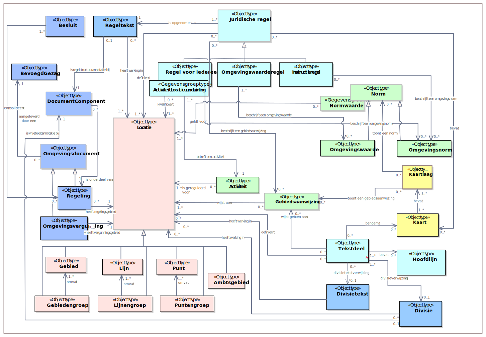

## Overzicht objecttypen

### UML-verbeelding CIMOW

Onderstaand diagram geeft een overzicht van alle CIMOW-onderwerpen, zoals een Activiteit, een Juridische regel of een functie. Alle gelijksoortige CIMOW-onderwerpen zijn een objecttype. Zo is een gebiedsaanwijzing van het Natura2000-gebied ‘Oosterschelde’ niet gelijk aan de gebiedsaanwijzing van de functie ‘Bedrijven categorie 2’, maar beide zijn wel een gebiedsaanwijzing en worden informatiekundig als gelijksoortig gezien.

<figure></img>
<figcaption> Figuur 1: Objecttypen uit CIMOW</figcaption></figure>

De donkerblauwe objecttypen (Regeltekst, Divisie, Divisietekst) zijn domeinspecifieke objecten die verwijzen naar objecten uit een officiële publicatie. Er zijn ook donkerblauwe objecten (Regeling, Besluit, BevoegdGezag, Omgevingsvergunning, DocumentComponent) waar niet naar verwezen wordt vanuit OW-objecten, maar die puur bestaan vanuit een officiële publicatie. De lichtblauwe objecttypen (Juridische regel, Hoofdlijn, Tekstdeel) zijn objecttypen die te maken hebben met OW-annotaties van de regeling van de officiële publicatie. De groene objecttypen (Norm, Omgevingswaarde, Omgevingsnorm, Gebiedsaanwijzing, Activiteit en Normwaarde) zijn objecten vanuit de regeling die op de kaart zichtbaar zijn. De lichtrode objecttypen zijn objecttypen die informatie bevatten over de geografische positie van andere objecten. De gele objecttypen (Kaart, Kaartlaag) zijn objecttypen die specifiek dienen voor het benoemen van kaarten.

Als een object een grijze rand heeft dan betekent dit dat het geen zelfstandig objecttype is, maar een abstract objecttype. Over abstracte objecttypen worden wel gegevens vastgelegd, maar zijn niet bij dat specifieke objecttype terug te vinden (zo worden er wel gegevens vastgelegd over Norm, maar deze zullen altijd terug te vinden zijn bij ofwel de omgevingsnorm of de omgevingswaarde). Uit de afbeelding is niet terug te zien dat een Omgevingsnorm één of meerdere normwaarden bevat, maar dit is wel terug te zien bij de kenmerken van Omgevingsnorm.

Er is onderscheid te maken tussen artikel-gestructureerde objecten, namelijk: Juridische regel en Regeltekst, en vrijetekststructuur-objecten, namelijk: Divisie en Tekstdeel.

#### Toelichting op artikel-gestructureerde objecten

Artikel-gestructureerde objecttypen komen voor bij omgevingsdocumenten die regels bevatten, dit zijn bijvoorbeeld: een omgevingsplan, een omgevingsverordening, een algemene maatregel van bestuur (AMvB), een ministeriële regeling (MR) of een waterschapsverordening.

Een regeltekst is een artikel of een lid, en bevat één of meer Juridische regels. De regels beschrijven bepaalde objecttypes, zoals een activiteit of een omgevingswaarde. Juridische regels beschrijven echter bijvoorbeeld geen Hoofdlijn. Er loopt dan ook geen relatiesoort tussen een Juridische Regel en een Hoofdlijn.

Door in het diagram op de vorige pagina naar de relaties van de Juridische regels te kijken is goed te zien welke objecttypes wel of niet in de context van de regels kunnen voorkomen. Zo heeft een juridische regel drie verschijningsvormen, namelijk:

<ul><li>Regel voor iedereen – te kiezen in het geval dat de juridische regel voor iedereen geldt;</li>
<li>Instructieregel – te kiezen in het geval het een regel is bedoeld voor een ander bevoegd gezag;</li>
<li>Omgevingswaarderegel – te kiezen in het geval een regel bedoeld is voor intern gebruik bij het bevoegd gezag;</li>
</ul>

Een regel voor iedereen kan een gebied aanwijzen (gebiedsaanwijzing) een activiteit duiden (activiteitaanduiding) of een omgevingsnorm (omgevingsnormaanduiding) beschrijven.

Een instructieregel kan een gebied aanwijzen of een omgevingsnorm beschrijven.

Een omgevingswaarderegel kan een omgevingswaarde duiden en een gebied aanwijzen.

#### Toelichting op vrijetekststructuur-objecten

Een tekstdeel duidt een specifiek deel vanuit de tekst waar informatie over vastgelegd dient te worden. Deze komt alleen voor indien het omgevingsdocument dat aangeleverd wordt niet artikel-gestructureerd is. Hiertoe mag dit omgevingsdocument ook geen juridische regels bevatten. Dit gebeurt bij bijvoorbeeld een omgevingsvisie, een projectbesluit, een instructie, een reactieve interventie of een programma.

Het tekstdeel is analoog aan de juridische regel in de zin dat deze verwijst naar een bepaald deel van het omgevingsdocument en hier specifieke objecten aan te koppelen zijn. In het tekstdeel staat de specifieke tekst zelf niet, want deze volgt uit de OP-standaard en wordt niet meegeleverd bij de OW-standaard.

right13970
<b>PERSPECTIEVEN</b>

De inhoudelijke kern van dit document bestaat

uit vijf perspectieven:

– Compacte stad

– Gezonde stad

– Inclusieve stad

– Circulaire stad

– Productieve stad

Deze perspectieven geven richting aan de

ambities van Rotterdam voor de fysieke

leefomgeving en zorgen daarmee voor

samenhang. Hiermee bieden de perspectieven

een ‘kompas’ voor keuzes en plannen voor de

fysieke leefomgeving.

4000020000
<b>PERSPECTIEVEN</b>

De inhoudelijke kern van dit document bestaat

uit vijf perspectieven:

– Compacte stad

– Gezonde stad

– Inclusieve stad

– Circulaire stad

– Productieve stad

Deze perspectieven geven richting aan de

ambities van Rotterdam voor de fysieke

leefomgeving en zorgen daarmee voor

samenhang. Hiermee bieden de perspectieven

een ‘kompas’ voor keuzes en plannen voor de

fysieke leefomgeving.

Aan een tekstdeel zijn een of meerdere hoofdlijnen te koppelen, zo volgt bijvoorbeeld uit de tekst aan de rechterzijde dat er vijf perspectieven zijn, in dit geval zou het soort hoofdlijn een ‘perspectief’ zijn en de naam van de hoofdlijn ‘Compacte stad’ of ‘Gezonde stad’.

### Objecttype Regeltekst

<table style='width: 100%;'><caption></caption>
<colgroup><col id='col1' style='width: 30%;'
<col id='col2' style='width: 70%;'
</colgroup>
<tbody valign='top'><tr><td align='left' style='border-top: 0pt none #; border-left: 0pt none #; border-bottom: 0pt none #; border-right: 0pt none #; background-color: none;'><b>Naam</b>

</td>
<td align='left' style='border-top: 0pt none #; border-left: 0pt none #; border-bottom: 0pt none #; border-right: 0pt none #; background-color: none;'>Regeltekst

</td>
</tr>
<tr><td align='left' style='border-top: 0pt none #; border-left: 0pt none #; border-bottom: 0pt none #; border-right: 0pt none #; background-color: none;'><b>Definitie</b>

</td>
<td align='left' style='border-top: 0pt none #; border-left: 0pt none #; border-bottom: 0pt none #; border-right: 0pt none #; background-color: none;'>Regeltekst is de kleinste zelfstandige eenheid van (een of meer) bij elkaar horende Juridische regels in het Lichaam van de Regeling van omgevingsdocumenten met Artikelstructuur, te weten een artikel of een lid.

</td>
</tr>
<tr><td align='left' style='border-top: 0pt none #; border-left: 0pt none #; border-bottom: 0pt none #; border-right: 0pt none #; background-color: none;'><b>Toelichting</b>

</td>
<td align='left' style='border-top: 0pt none #; border-left: 0pt none #; border-bottom: 0pt none #; border-right: 0pt none #; background-color: none;'>In het domein Omgevingswet worden juridische regels vastgelegd door middel van juridische tekst. Dit afgebakende stuk tekst met bij elkaar behorende regels heet Regeltekst. De afbakening is bij de Omgevingswet altijd een artikel of een lid. De regeltekst bevat de <b>inhoud</b> van een artikel of lid. Deze inhoud is breder dan de tekst, daarom heeft een Regeltekst ook meer kenmerken dan alleen tekst.

In spreektaal: een groep van bij elkaar behorende regels heeft een werkingsgebied. Informatiekundig: een Regeltekst (artikel of lid) heeft een kenmerk ‘werkingsgebied’, en dit kenmerk is een verwijzing naar een (of meer) Locatie(s). De regels die in de Regeltekst zijn opgenomen hebben werkingskracht in het werkingsgebied van de regeltekst.

Het is mogelijk om te verwijzen naar een Regeltekst. Daarom heeft een Regeltekst een identificatie.

De regeltekst vindt zijn oorsprong in het OP-domein. De regeltekst in dit informatiemodel beschouwt het Artikel en het Lid uit het OP-domein, vanuit het perspectief van het OW-domein (en is in deze een «view»[2] Een «view» , zoals gedefinieerd in het metamodel voor informatiemodellen (versie 1.0): Een groepering van objecttypen die gespecificeerd zijn in een extern informatiemodel en vanuit het perspectief van het eigen informatiemodel inzicht geeft welke gegevens van deze objecttypen relevant zijn binnen het eigen informatiemodel.  op het OP-domein). Oftewel, de informatie van het Artikel of Lid uit het OP-domein, beperkt tot de kenmerken voor zover deze voor het OW-domein relevant zijn, en indien nodig aangevuld met OW-specifieke kenmerken.

</td>
</tr>
<tr><td align='left' style='border-top: 0pt none #; border-left: 0pt none #; border-bottom: 0pt none #; border-right: 0pt none #; background-color: none;'><b>Constraint</b><b>(s)</b>

</td>
<td align='left' style='border-top: 0pt none #; border-left: 0pt none #; border-bottom: 0pt none #; border-right: 0pt none #; background-color: none;'><b>\{</b> <b>1 type Juridische regel per Regeltekst</b> <b>\}</b>

Een afspraak voor bevoegd gezagen aangaande het schrijven van regelteksten. Het effect ervan op de informatie is dat alle regels in een regeltekst altijd van dezelfde soort zijn. Ofwel een Regel voor iedereen, ofwel een Omgevingswaarde regel ofwel een Instructieregel. Het is verplicht een juridische regel mee te leveren bij een Regeltekst.

\{ <b>indien gebruik gemaakt wordt van Leden, niet verwijzen naar Artikel</b> \}

Indien er een Regeltekst is van een bepaald Lid, dan mag er niet verwezen worden naar de Regeltekst van het Artikel dat hetzelfde Lid bevat. Er dient een keuze gemaakt te worden voor ofwel het annoteren op Lid-niveau of op Artikelniveau. Het bevoegd gezag is verplicht op Lid te annoteren als er Leden worden aangeleverd.

</td>
</tr>
<tr><td align='left' style='border-top: 0pt none #; border-left: 0pt none #; border-bottom: 0pt none #; border-right: 0pt none #; background-color: none;'><b>Herkomst</b>

</td>
<td align='left' style='border-top: 0pt none #; border-left: 0pt none #; border-bottom: 0pt none #; border-right: 0pt none #; background-color: none;'>OW

</td>
</tr>
</tbody>
</table>

### Objecttype Juridische regel

<table style='width: 100%;'><caption></caption>
<colgroup><col id='col1' style='width: 30%;'
<col id='col2' style='width: 70%;'
</colgroup>
<tbody valign='top'><tr><td align='left' style='border-top: 0pt none #; border-left: 0pt none #; border-bottom: 0pt none #; border-right: 0pt none #; background-color: none;'><b>Naam</b>

</td>
<td align='left' style='border-top: 0pt none #; border-left: 0pt none #; border-bottom: 0pt none #; border-right: 0pt none #; background-color: none;'>Juridische regel

</td>
</tr>
<tr><td align='left' style='border-top: 0pt none #; border-left: 0pt none #; border-bottom: 0pt none #; border-right: 0pt none #; background-color: none;'><b>Definitie</b>

</td>
<td align='left' style='border-top: 0pt none #; border-left: 0pt none #; border-bottom: 0pt none #; border-right: 0pt none #; background-color: none;'>De beschrijving van een regel met juridische werkingskracht.

</td>
</tr>
<tr><td align='left' style='border-top: 0pt none #; border-left: 0pt none #; border-bottom: 0pt none #; border-right: 0pt none #; background-color: none;'><b>Toelichting</b>

</td>
<td align='left' style='border-top: 0pt none #; border-left: 0pt none #; border-bottom: 0pt none #; border-right: 0pt none #; background-color: none;'>Met een juridische regel wordt niet (alleen) de tekst van de regel bedoeld, maar regel als geheel. Deze bestaat o.a. uit tekst, wat hét centrale deel is van een juridische regel, maar de juridische regel heeft ook andere kenmerken, zoals bijvoorbeeld een idealisatie en een locatieaanduiding. Deze worden beschreven in het volgende hoofdstuk.

Regels gelden voor een bepaalde specifieke locatie(s) in de fysieke leefomgeving, of voor een heel grondgebied een bevoegd gezag. De regels verwijzen naar deze locaties, deze verwijzing heet: <b>locatieaanduiding</b>. De locatie van een juridische regel kan afwijken van de activiteit, norm of gebiedsaanwijzing die gedaan wordt. In dat geval wordt daarmee gezegd: deze regel geldt voor deze locatie, en heeft nog een informatieobject dat een andere locatie heeft. Bijvoorbeeld: “In de buitenzone van het stiltegebied geldt de norm conform de GIO ‘buitenzone’ en in de binnenzone geldt de norm conform de GIO ‘binnenzone’.” In dit geval zijn er twee normen die gesteld worden met andere locaties (buitenzone en binnenzone) dan de juridische regel (stiltegebied). Tevens kan een bevoegd gezag er voor kiezen om de juridische regel voor het gehele grondgebied geldig te laten zijn. De locatieaanduiding van een juridische regel bepaalt waar een regel werking heeft (werkingsgebied) en wanneer een regel relevant is (c.q. een raadpleger een bepaalde regel te zien krijgt in het DSO-LV).

Ad. veelal. Er zijn ook regels <i>zonder</i> een relatie naar een informatiekundige activiteit, norm, of gebiedsaanwijzing. Dit is bijvoorbeeld zo bij begripsbepalingen, maar kan ook voorkomen bij normstellende regels.

<ul><li>Een begripsbepaling geeft aan wat er onder een bepaald begrip of term wordt verstaan. Zo’n begripsbepaling staat op zichzelf, maar wordt wel gezien als een juridische regel. Deze beschrijft echter niet een activiteit, en/of norm en/of functie en en/of beperkingengebied en heeft hier dan ook geen relatie naar toe.</li>
<li>Een normstellende regel kan het in de juridische tekst wel over bijvoorbeeld een activiteit hebben, maar het daarbij laten door de activiteit informatiekundig niet (expliciet) aan te geven. Er is dan geen informatiekundig activiteit gecreëerd en daar kan dan natuurlijk ook niet naar verwezen worden via een relatie. Informatiekundig is er dan <u>alleen</u> sprake van een juridische regel. Een voorbeeld van zo’n normstellende regel zonder een expliciete verwijzing naar informatiekundige activiteit is: “Er geldt een algemeen rookverbod in de openbare ruimtes binnen het centrumgebied van Groningen”.</li>
</ul>

Een juridische regel wordt altijd opgesteld in de context van andere juridische regels. Deze context is altijd van belang bij het juridisch interpreteren van de regel(s). Lees daarom altijd ook het artikel.

 

</td>
</tr>
<tr><td align='left' style='border-top: 0pt none #; border-left: 0pt none #; border-bottom: 0pt none #; border-right: 0pt none #; background-color: none;'><b>Abstract</b>

</td>
<td align='left' style='border-top: 0pt none #; border-left: 0pt none #; border-bottom: 0pt none #; border-right: 0pt none #; background-color: none;'><b>Ja</b>

Dit betekent dat dit modelelement niet op zichzelf bestaat, maar dat het altijd een van de volgende drie typen regels betreft: Regels voor iedereen, Instructieregel en Omgevingswaarderegel. 

</td>
</tr>
</tbody>
</table>

### Objecttype Regel voor iedereen

<table style='width: 100%;'><caption></caption>
<colgroup><col id='col1' style='width: 30%;'
<col id='col2' style='width: 70%;'
</colgroup>
<tbody valign='top'><tr><td align='left' style='border-top: 0pt none #; border-left: 0pt none #; border-bottom: 0pt none #; border-right: 0pt none #; background-color: none;'><b>Naam</b>

</td>
<td align='left' style='border-top: 0pt none #; border-left: 0pt none #; border-bottom: 0pt none #; border-right: 0pt none #; background-color: none;'>Regel voor iedereen

</td>
</tr>
<tr><td align='left' style='border-top: 0pt none #; border-left: 0pt none #; border-bottom: 0pt none #; border-right: 0pt none #; background-color: none;'><b>Definitie</b>

</td>
<td align='left' style='border-top: 0pt none #; border-left: 0pt none #; border-bottom: 0pt none #; border-right: 0pt none #; background-color: none;'>Een Juridische regel die voor eenieder werking heeft.

</td>
</tr>
<tr><td align='left' style='border-top: 0pt none #; border-left: 0pt none #; border-bottom: 0pt none #; border-right: 0pt none #; background-color: none;'><b>Toelichting</b>

</td>
<td align='left' style='border-top: 0pt none #; border-left: 0pt none #; border-bottom: 0pt none #; border-right: 0pt none #; background-color: none;'>Het betreft hier een algemeen geldende regel met directe werking voor eenieder. Anders gezegd, deze regels gelden voor eenieder in Nederland, inclusief voor de bevoegde gezagen zelf. 

</td>
</tr>
</tbody>
</table>

### Objecttype Instructieregel

<table style='width: 100%;'><caption></caption>
<colgroup><col id='col1' style='width: 30%;'
<col id='col2' style='width: 70%;'
</colgroup>
<tbody valign='top'><tr><td align='left' style='border-top: 0pt none #; border-left: 0pt none #; border-bottom: 0pt none #; border-right: 0pt none #; background-color: none;'><b>Naam</b>

</td>
<td align='left' style='border-top: 0pt none #; border-left: 0pt none #; border-bottom: 0pt none #; border-right: 0pt none #; background-color: none;'>Instructieregel

</td>
</tr>
<tr><td align='left' style='border-top: 0pt none #; border-left: 0pt none #; border-bottom: 0pt none #; border-right: 0pt none #; background-color: none;'><b>Definitie</b>

</td>
<td align='left' style='border-top: 0pt none #; border-left: 0pt none #; border-bottom: 0pt none #; border-right: 0pt none #; background-color: none;'>De beschrijving van een juridische regel met een instructie die betrekking heeft op een extern omgevingsdocument of een orgaan.

</td>
</tr>
<tr><td align='left' style='border-top: 0pt none #; border-left: 0pt none #; border-bottom: 0pt none #; border-right: 0pt none #; background-color: none;'><b>Toelichting</b>

</td>
<td align='left' style='border-top: 0pt none #; border-left: 0pt none #; border-bottom: 0pt none #; border-right: 0pt none #; background-color: none;'>Het betreft hier juridische regel die instructie geeft aan andere overheden, gericht op externe omgevingsdocumenten, of een taakuitoefening.

Een ander omgevingsdocument is bijvoorbeeld een Omgevingsplan, Omgevingsverordening en Waterschapsverordening.

Een taakuitoefening is voor bijvoorbeeld een gemeentebestuur of een wildbeheereenheid.

Een instructieregel is alleen gericht op een Omgevingsnorm of een Gebiedsaanduiding, zoals een Functie of een Beperkingengebied (en eventueel meerdere). 

</td>
</tr>
</tbody>
</table>

### Objecttype Omgevingswaarderegel

<table style='width: 100%;'><caption></caption>
<colgroup><col id='col1' style='width: 30%;'
<col id='col2' style='width: 70%;'
</colgroup>
<tbody valign='top'><tr><td align='left' style='border-top: 0pt none #; border-left: 0pt none #; border-bottom: 0pt none #; border-right: 0pt none #; background-color: none;'><b>Naam</b>

</td>
<td align='left' style='border-top: 0pt none #; border-left: 0pt none #; border-bottom: 0pt none #; border-right: 0pt none #; background-color: none;'>Omgevingswaarderegel

</td>
</tr>
<tr><td align='left' style='border-top: 0pt none #; border-left: 0pt none #; border-bottom: 0pt none #; border-right: 0pt none #; background-color: none;'><b>Definitie</b>

</td>
<td align='left' style='border-top: 0pt none #; border-left: 0pt none #; border-bottom: 0pt none #; border-right: 0pt none #; background-color: none;'>De beschrijving van een juridische regel gericht op een gestelde omgevingswaarde.

</td>
</tr>
<tr><td align='left' style='border-top: 0pt none #; border-left: 0pt none #; border-bottom: 0pt none #; border-right: 0pt none #; background-color: none;'><b>Toelichting</b>

</td>
<td align='left' style='border-top: 0pt none #; border-left: 0pt none #; border-bottom: 0pt none #; border-right: 0pt none #; background-color: none;'>Het betreft hier een juridische regel die verplichtingen oplegt aan het bevoegd gezag dat deze regel opstelt.

Een omgevingswaarderegel is alleen gericht op een Omgevingswaarde (eventueel meerdere).

</td>
</tr>
</tbody>
</table>

### Objecttype Activiteit

<table style='width: 100%;'><caption></caption>
<colgroup><col id='col1' style='width: 30%;'
<col id='col2' style='width: 70%;'
</colgroup>
<tbody valign='top'><tr><td align='left' style='border-top: 0pt none #; border-left: 0pt none #; border-bottom: 0pt none #; border-right: 0pt none #; background-color: none;'><b>Naam</b>

</td>
<td align='left' style='border-top: 0pt none #; border-left: 0pt none #; border-bottom: 0pt none #; border-right: 0pt none #; background-color: none;'>Activiteit

</td>
</tr>
<tr><td align='left' style='border-top: 0pt none #; border-left: 0pt none #; border-bottom: 0pt none #; border-right: 0pt none #; background-color: none;'><b>Definitie</b>

</td>
<td align='left' style='border-top: 0pt none #; border-left: 0pt none #; border-bottom: 0pt none #; border-right: 0pt none #; background-color: none;'>Een activiteit is ieder menselijk handelen (of nalaten) waarbij, of waardoor een verandering of effect in de fysieke leefomgeving wordt of kan worden bewerkstelligd.

</td>
</tr>
<tr><td align='left' style='border-top: 0pt none #; border-left: 0pt none #; border-bottom: 0pt none #; border-right: 0pt none #; background-color: none;'><b>Toelichting</b> 

</td>
<td align='left' style='border-top: 0pt none #; border-left: 0pt none #; border-bottom: 0pt none #; border-right: 0pt none #; background-color: none;'>Bijvoorbeeld: het lozen van afvalwater    exploiteren van een jachthaven.

Het objecttype activiteit is een typering van alle activiteiten die bijvoorbeeld een initiatiefnemer kan uitvoeren in de leefomgeving. Er wordt geen specifieke activiteit bedoeld die een specifieke initiatiefnemer voornemens is om uit te voeren, maar het type activiteit waarover regels opgesteld zijn. 

</td>
</tr>
<tr><td align='left' style='border-top: 0pt none #; border-left: 0pt none #; border-bottom: 0pt none #; border-right: 0pt none #; background-color: none;'><b>Juridische bron</b>

</td>
<td align='left' style='border-top: 0pt none #; border-left: 0pt none #; border-bottom: 0pt none #; border-right: 0pt none #; background-color: none;'>De juridische bron van een activiteit is altijd de regeling waar de definitie van de Activiteit in is benoemd. 

</td>
</tr>
</tbody>
</table>

### Objecttype Omgevingswaarde

<table style='width: 100%;'><caption></caption>
<colgroup><col id='col1' style='width: 30%;'
<col id='col2' style='width: 70%;'
</colgroup>
<tbody valign='top'><tr><td align='left' style='border-top: 0pt none #; border-left: 0pt none #; border-bottom: 0pt none #; border-right: 0pt none #; background-color: none;'><b>Naam</b>

</td>
<td align='left' style='border-top: 0pt none #; border-left: 0pt none #; border-bottom: 0pt none #; border-right: 0pt none #; background-color: none;'>Omgevingswaarde

</td>
</tr>
<tr><td align='left' style='border-top: 0pt none #; border-left: 0pt none #; border-bottom: 0pt none #; border-right: 0pt none #; background-color: none;'><b>Definitie</b>

</td>
<td align='left' style='border-top: 0pt none #; border-left: 0pt none #; border-bottom: 0pt none #; border-right: 0pt none #; background-color: none;'>Een norm die voor (een onderdeel van) de fysieke leefomgeving de gewenste staat of kwaliteit, de toelaatbare belasting door activiteiten en/of de toelaatbare concentratie of depositie van stoffen als beleidsdoel vastlegt.

</td>
</tr>
<tr><td align='left' style='border-top: 0pt none #; border-left: 0pt none #; border-bottom: 0pt none #; border-right: 0pt none #; background-color: none;'><b>Toelichting</b>

</td>
<td align='left' style='border-top: 0pt none #; border-left: 0pt none #; border-bottom: 0pt none #; border-right: 0pt none #; background-color: none;'>Bijvoorbeeld: streefwaarden of maximaal toelaatbare waarden voor luchtkwaliteit, kwaliteit van oppervlaktewater, grondwater of zwemwater. Alle omgevingswaarden hebben als herkomst omgevingsdocumenten.

Omgevingswaarden worden uitgedrukt in meetbare of berekenbare eenheden of anderszins in objectieve termen. Een omgevingswaarde is bindend voor de overheid die de omgevingswaarde heeft vastgesteld en heeft geen rechtstreekse werking voor anderen. Omgevingswaarden zijn een concretisering van de maatschappelijke doelen die met de Omgevingswet worden nagestreefd. Zij hebben betrekking op de hoedanigheid en eigenschappen van de fysieke leefomgeving (de staat, kwaliteit of inrichting van de omgeving). Omgevingswaarden dienen als referentiekader bij de inzet van instrumenten en bevoegdheden van de overheid.

De Omgevingswaarde is niet de regel zelf. De regel beschrijft wat er juridisch geldt voor dit object. De juridische tekst waarin dit object genoemd is, is te vinden in de juridische regel, en niet in dit object.

</td>
</tr>
</tbody>
</table>

### Objecttype Omgevingsnorm

<table style='width: 100%;'><caption></caption>
<colgroup><col id='col1' style='width: 30%;'
<col id='col2' style='width: 70%;'
</colgroup>
<tbody valign='top'><tr><td align='left' style='border-top: 0pt none #; border-left: 0pt none #; border-bottom: 0pt none #; border-right: 0pt none #; background-color: none;'><b>Naam</b>

</td>
<td align='left' style='border-top: 0pt none #; border-left: 0pt none #; border-bottom: 0pt none #; border-right: 0pt none #; background-color: none;'>Omgevingsnorm

</td>
</tr>
<tr><td align='left' style='border-top: 0pt none #; border-left: 0pt none #; border-bottom: 0pt none #; border-right: 0pt none #; background-color: none;'><b>Definitie</b>

</td>
<td align='left' style='border-top: 0pt none #; border-left: 0pt none #; border-bottom: 0pt none #; border-right: 0pt none #; background-color: none;'>Een norm over de fysieke leefomgeving die in een kwantitatieve of kwalitatieve waarde wordt uitgedrukt en geen omgevingswaarde is.

</td>
</tr>
<tr><td align='left' style='border-top: 0pt none #; border-left: 0pt none #; border-bottom: 0pt none #; border-right: 0pt none #; background-color: none;'><b>Toelichting</b>

</td>
<td align='left' style='border-top: 0pt none #; border-left: 0pt none #; border-bottom: 0pt none #; border-right: 0pt none #; background-color: none;'>Bijvoorbeeld: maximum bouwhoogte, maximum aantal parkeerplaatsen, maximum geluidbelasting, maximum aantal bezoekers

Alle omgevingsnormen hebben als herkomst omgevingsdocumenten.

De Omgevingsnorm is niet de regel zelf. De regel beschrijft wat er juridisch geldt voor dit object. De juridische tekst waarin dit object genoemd is, is te vinden in de juridische regel, en niet in dit object.

</td>
</tr>
</tbody>
</table>

### Objecttype Norm

<table style='width: 100%;'><caption></caption>
<colgroup><col id='col1' style='width: 30%;'
<col id='col2' style='width: 70%;'
</colgroup>
<tbody valign='top'><tr><td align='left' style='border-top: 0pt none #; border-left: 0pt none #; border-bottom: 0pt none #; border-right: 0pt none #; background-color: none;'><b>Naam</b>

</td>
<td align='left' style='border-top: 0pt none #; border-left: 0pt none #; border-bottom: 0pt none #; border-right: 0pt none #; background-color: none;'>Norm

</td>
</tr>
<tr><td align='left' style='border-top: 0pt none #; border-left: 0pt none #; border-bottom: 0pt none #; border-right: 0pt none #; background-color: none;'><b>Definitie</b>

</td>
<td align='left' style='border-top: 0pt none #; border-left: 0pt none #; border-bottom: 0pt none #; border-right: 0pt none #; background-color: none;'>Een omgevingswaarde of een omgevingsnorm, met een normatief karakter, die beschreven worden middels normwaarden. 

</td>
</tr>
<tr><td align='left' style='border-top: 0pt none #; border-left: 0pt none #; border-bottom: 0pt none #; border-right: 0pt none #; background-color: none;'><b>Toelichting</b>

</td>
<td align='left' style='border-top: 0pt none #; border-left: 0pt none #; border-bottom: 0pt none #; border-right: 0pt none #; background-color: none;'>Een norm kan bestaan uit meerdere normwaarden, die dan veelal afzonderlijk gelden voor aparte gebieden. Bijvoorbeeld: de norm maximum bouwhoogte bestaat uit twee normwaarden:

<ul><li>maximum bouwhoogte 10 meter geldt voor een aantal locaties;</li>
<li>maximum bouwhoogte 12 meter geldt voor een aantal andere locaties.</li>
</ul>

Een juridische regel geeft de norm als geheel werkingskracht (niet de individuele normwaarden).

De Omgevingswet kent ook normstellende regels in bredere zin, welke niet als een omgevingswaarde of omgevingsnorm zijn opgenomen, maar enkel als een juridische regel met een omschrijving in tekst.

</td>
</tr>
<tr><td align='left' style='border-top: 0pt none #; border-left: 0pt none #; border-bottom: 0pt none #; border-right: 0pt none #; background-color: none;'><b>Abstract</b>

</td>
<td align='left' style='border-top: 0pt none #; border-left: 0pt none #; border-bottom: 0pt none #; border-right: 0pt none #; background-color: none;'><b>Ja</b>.

Dit betekent dat dit modelelement niet op zichzelf bestaat, maar dat het altijd een Omgevingswaarde of een Omgevingsnorm betreft.

</td>
</tr>
</tbody>
</table>

### Objecttype Functie

<table style='width: 100%;'><caption></caption>
<colgroup><col id='col1' style='width: 30%;'
<col id='col2' style='width: 70%;'
</colgroup>
<tbody valign='top'><tr><td align='left' style='border-top: 0pt none #; border-left: 0pt none #; border-bottom: 0pt none #; border-right: 0pt none #; background-color: none;'><b>Naam</b>

</td>
<td align='left' style='border-top: 0pt none #; border-left: 0pt none #; border-bottom: 0pt none #; border-right: 0pt none #; background-color: none;'>Functie

</td>
</tr>
<tr><td align='left' style='border-top: 0pt none #; border-left: 0pt none #; border-bottom: 0pt none #; border-right: 0pt none #; background-color: none;'><b>Definitie</b>

</td>
<td align='left' style='border-top: 0pt none #; border-left: 0pt none #; border-bottom: 0pt none #; border-right: 0pt none #; background-color: none;'>Het gebruiksdoel of de bijzondere eigenschap die een onderdeel van de fysieke leefomgeving op een bepaalde locatie heeft.

</td>
</tr>
<tr><td align='left' style='border-top: 0pt none #; border-left: 0pt none #; border-bottom: 0pt none #; border-right: 0pt none #; background-color: none;'><b>Toelichting</b>

</td>
<td align='left' style='border-top: 0pt none #; border-left: 0pt none #; border-bottom: 0pt none #; border-right: 0pt none #; background-color: none;'>Voorbeeld: centrumgebied, bedrijventerrein.

In spreektaal: een gebied heeft een functie.

Informatiekundig: een functie is een zelfstandig informatieobject dat via een verwijzing een gebied aanwijst.

De functie is niet de regel zelf. De regel beschrijft wat er juridisch geldt voor dit object. De juridische tekst waarin dit object genoemd is, is te vinden in de juridische regel, en niet in dit object.

</td>
</tr>
<tr><td align='left' style='border-top: 0pt none #; border-left: 0pt none #; border-bottom: 0pt none #; border-right: 0pt none #; background-color: none;'><b>Label</b>

</td>
<td align='left' style='border-top: 0pt none #; border-left: 0pt none #; border-bottom: 0pt none #; border-right: 0pt none #; background-color: none;'>Functies

</td>
</tr>
</tbody>
</table>

### Objecttype Beperkingengebied

<table style='width: 100%;'><caption></caption>
<colgroup><col id='col1' style='width: 30%;'
<col id='col2' style='width: 70%;'
</colgroup>
<tbody valign='top'><tr><td align='left' style='border-top: 0pt none #; border-left: 0pt none #; border-bottom: 0pt none #; border-right: 0pt none #; background-color: none;'><b>Naam</b>

</td>
<td align='left' style='border-top: 0pt none #; border-left: 0pt none #; border-bottom: 0pt none #; border-right: 0pt none #; background-color: none;'>Beperkingengebied 

</td>
</tr>
<tr><td align='left' style='border-top: 0pt none #; border-left: 0pt none #; border-bottom: 0pt none #; border-right: 0pt none #; background-color: none;'><b>Definitie</b>

</td>
<td align='left' style='border-top: 0pt none #; border-left: 0pt none #; border-bottom: 0pt none #; border-right: 0pt none #; background-color: none;'>Een bij of krachtens de wet aangewezen gebied waar, vanwege de aanwezigheid van een werk of object, regels gelden over activiteiten die gevolgen hebben of kunnen hebben voor dat werk of object.

</td>
</tr>
<tr><td align='left' style='border-top: 0pt none #; border-left: 0pt none #; border-bottom: 0pt none #; border-right: 0pt none #; background-color: none;'><b>Toelichting</b>

</td>
<td align='left' style='border-top: 0pt none #; border-left: 0pt none #; border-bottom: 0pt none #; border-right: 0pt none #; background-color: none;'>Voorbeeld: een luchthaven, een spoorweg of een snelweg, een waterstaatswerk.

Op de weg geldt bijvoorbeeld een snelheidsbeperking of een inhaalverbod. De regels hieromtrent zijn vaak landelijk vastgesteld, maar de gebieden waarvoor deze regels gelden worden lokaal aangewezen.

In spreektaal: een gebied is een beperkingengebied.

Informatiekundig: een beperkingengebied is een zelfstandig informatieobject, welke een gebied aanwijst, via een verwijzing ernaartoe.

Het beperkingengebied is niet de regel zelf. De regel beschrijft wat er juridisch geldt voor dit object. De juridische tekst waarin dit object genoemd is, is te vinden in de juridische regel, en niet in dit object.

</td>
</tr>
<tr><td align='left' style='border-top: 0pt none #; border-left: 0pt none #; border-bottom: 0pt none #; border-right: 0pt none #; background-color: none;'><b>Label</b>

</td>
<td align='left' style='border-top: 0pt none #; border-left: 0pt none #; border-bottom: 0pt none #; border-right: 0pt none #; background-color: none;'>Beperkingengebieden

</td>
</tr>
</tbody>
</table>

### Objecttype Gebiedsaanwijzing

<table style='width: 100%;'><caption></caption>
<colgroup><col id='col1' style='width: 30%;'
<col id='col2' style='width: 70%;'
</colgroup>
<tbody valign='top'><tr><td align='left' style='border-top: 0pt none #; border-left: 0pt none #; border-bottom: 0pt none #; border-right: 0pt none #; background-color: none;'><b>Naam</b>

</td>
<td align='left' style='border-top: 0pt none #; border-left: 0pt none #; border-bottom: 0pt none #; border-right: 0pt none #; background-color: none;'>Gebiedsaanwijzing

</td>
</tr>
<tr><td align='left' style='border-top: 0pt none #; border-left: 0pt none #; border-bottom: 0pt none #; border-right: 0pt none #; background-color: none;'><b>Definitie</b>

</td>
<td align='left' style='border-top: 0pt none #; border-left: 0pt none #; border-bottom: 0pt none #; border-right: 0pt none #; background-color: none;'>Een door regels of beleid aangewezen gebied.

</td>
</tr>
<tr><td align='left' style='border-top: 0pt none #; border-left: 0pt none #; border-bottom: 0pt none #; border-right: 0pt none #; background-color: none;'><b>Toelichting</b>

</td>
<td align='left' style='border-top: 0pt none #; border-left: 0pt none #; border-bottom: 0pt none #; border-right: 0pt none #; background-color: none;'>Voorbeeld: bebouwde kom.

In spreektaal: dit gebied is aangewezen als bebouwde kom en dit is de functie van dit gebied. Informatiekundig: een aangewezen gebied met de naam bebouwde kom heeft een locatieaanduiding naar een locatie/gebied. Deze locatieaanduiding is een verwijzing, omdat dezelfde locatie ook in de context van een andere aangewezen gebied, of in de context van andere regels, aangewezen of aangeduid kan worden. 

</td>
</tr>
<tr><td align='left' style='border-top: 0pt none #; border-left: 0pt none #; border-bottom: 0pt none #; border-right: 0pt none #; background-color: none;'><b>Abstract</b>

</td>
<td align='left' style='border-top: 0pt none #; border-left: 0pt none #; border-bottom: 0pt none #; border-right: 0pt none #; background-color: none;'><b>Ja</b>.

Dit betekent dat dit modelelement niet op zichzelf bestaat, maar dat het altijd een specifiek type Gebiedsaanwijzing betreft. 

</td>
</tr>
</tbody>
</table>

### Objecttype Bodem

<table style='width: 100%;'><caption></caption>
<colgroup><col id='col1' style='width: 30%;'
<col id='col2' style='width: 70%;'
</colgroup>
<tbody valign='top'><tr><td align='left' style='border-top: 0pt none #; border-left: 0pt none #; border-bottom: 0pt none #; border-right: 0pt none #; background-color: none;'><b>Naam</b>

</td>
<td align='left' style='border-top: 0pt none #; border-left: 0pt none #; border-bottom: 0pt none #; border-right: 0pt none #; background-color: none;'>Bodem

</td>
</tr>
<tr><td align='left' style='border-top: 0pt none #; border-left: 0pt none #; border-bottom: 0pt none #; border-right: 0pt none #; background-color: none;'><b>Definitie</b>

</td>
<td align='left' style='border-top: 0pt none #; border-left: 0pt none #; border-bottom: 0pt none #; border-right: 0pt none #; background-color: none;'>Een aangewezen gebied gericht op de bescherming van de bodemkwaliteit.

</td>
</tr>
<tr><td align='left' style='border-top: 0pt none #; border-left: 0pt none #; border-bottom: 0pt none #; border-right: 0pt none #; background-color: none;'><b>Toelichting</b>

</td>
<td align='left' style='border-top: 0pt none #; border-left: 0pt none #; border-bottom: 0pt none #; border-right: 0pt none #; background-color: none;'>Voorbeelden zijn te vinden in de stelselcatalogus aangezien de verschillende groepen die gekozen kunnen worden onder Bodem bijgehouden worden in de Stelselcatalogus.

</td>
</tr>
<tr><td align='left' style='border-top: 0pt none #; border-left: 0pt none #; border-bottom: 0pt none #; border-right: 0pt none #; background-color: none;'><b>Label</b>

</td>
<td align='left' style='border-top: 0pt none #; border-left: 0pt none #; border-bottom: 0pt none #; border-right: 0pt none #; background-color: none;'>Bodemgebiedsaanwijzingen

</td>
</tr>
</tbody>
</table>

### Objecttype Bouw

<table style='width: 100%;'><caption></caption>
<colgroup><col id='col1' style='width: 30%;'
<col id='col2' style='width: 70%;'
</colgroup>
<tbody valign='top'><tr><td align='left' style='border-top: 0pt none #; border-left: 0pt none #; border-bottom: 0pt none #; border-right: 0pt none #; background-color: none;'><b>Naam</b>

</td>
<td align='left' style='border-top: 0pt none #; border-left: 0pt none #; border-bottom: 0pt none #; border-right: 0pt none #; background-color: none;'>Bouw

</td>
</tr>
<tr><td align='left' style='border-top: 0pt none #; border-left: 0pt none #; border-bottom: 0pt none #; border-right: 0pt none #; background-color: none;'><b>Definitie</b>

</td>
<td align='left' style='border-top: 0pt none #; border-left: 0pt none #; border-bottom: 0pt none #; border-right: 0pt none #; background-color: none;'>Een aangewezen gebied gericht op het reguleren van de situering van bouwwerken.

</td>
</tr>
<tr><td align='left' style='border-top: 0pt none #; border-left: 0pt none #; border-bottom: 0pt none #; border-right: 0pt none #; background-color: none;'><b>Toelichting</b>

</td>
<td align='left' style='border-top: 0pt none #; border-left: 0pt none #; border-bottom: 0pt none #; border-right: 0pt none #; background-color: none;'>Voorbeelden zijn te vinden in de stelselcatalogus aangezien de verschillende groepen die gekozen kunnen worden onder Bouw bijgehouden worden in de Stelselcatalogus.

</td>
</tr>
<tr><td align='left' style='border-top: 0pt none #; border-left: 0pt none #; border-bottom: 0pt none #; border-right: 0pt none #; background-color: none;'><b>Label</b>

</td>
<td align='left' style='border-top: 0pt none #; border-left: 0pt none #; border-bottom: 0pt none #; border-right: 0pt none #; background-color: none;'>Bouwgebiedsaanwijzingen

</td>
</tr>
</tbody>
</table>

### Objecttype Defensie

<table style='width: 100%;'><caption></caption>
<colgroup><col id='col1' style='width: 30%;'
<col id='col2' style='width: 70%;'
</colgroup>
<tbody valign='top'><tr><td align='left' style='border-top: 0pt none #; border-left: 0pt none #; border-bottom: 0pt none #; border-right: 0pt none #; background-color: none;'><b>Naam</b>

</td>
<td align='left' style='border-top: 0pt none #; border-left: 0pt none #; border-bottom: 0pt none #; border-right: 0pt none #; background-color: none;'>Defensie

</td>
</tr>
<tr><td align='left' style='border-top: 0pt none #; border-left: 0pt none #; border-bottom: 0pt none #; border-right: 0pt none #; background-color: none;'><b>Definitie</b>

</td>
<td align='left' style='border-top: 0pt none #; border-left: 0pt none #; border-bottom: 0pt none #; border-right: 0pt none #; background-color: none;'>Een aangewezen gebied gericht op de effecten, de bescherming en het tegengaan van verstoring van militaire gebieden en objecten.

</td>
</tr>
<tr><td align='left' style='border-top: 0pt none #; border-left: 0pt none #; border-bottom: 0pt none #; border-right: 0pt none #; background-color: none;'><b>Toelichting</b>

</td>
<td align='left' style='border-top: 0pt none #; border-left: 0pt none #; border-bottom: 0pt none #; border-right: 0pt none #; background-color: none;'>Voorbeelden zijn te vinden in de stelselcatalogus aangezien de verschillende groepen die gekozen kunnen worden onder Defensie bijgehouden worden in de Stelselcatalogus.

</td>
</tr>
<tr><td align='left' style='border-top: 0pt none #; border-left: 0pt none #; border-bottom: 0pt none #; border-right: 0pt none #; background-color: none;'><b>Label</b>

</td>
<td align='left' style='border-top: 0pt none #; border-left: 0pt none #; border-bottom: 0pt none #; border-right: 0pt none #; background-color: none;'>Defensiegebiedsaanwijzingen

</td>
</tr>
</tbody>
</table>

### Objecttype Energievoorziening

<table style='width: 100%;'><caption></caption>
<colgroup><col id='col1' style='width: 30%;'
<col id='col2' style='width: 70%;'
</colgroup>
<tbody valign='top'><tr><td align='left' style='border-top: 0pt none #; border-left: 0pt none #; border-bottom: 0pt none #; border-right: 0pt none #; background-color: none;'><b>Naam</b>

</td>
<td align='left' style='border-top: 0pt none #; border-left: 0pt none #; border-bottom: 0pt none #; border-right: 0pt none #; background-color: none;'>Energievoorziening

</td>
</tr>
<tr><td align='left' style='border-top: 0pt none #; border-left: 0pt none #; border-bottom: 0pt none #; border-right: 0pt none #; background-color: none;'><b>Definitie</b>

</td>
<td align='left' style='border-top: 0pt none #; border-left: 0pt none #; border-bottom: 0pt none #; border-right: 0pt none #; background-color: none;'>Een aangewezen gebied gericht op de bescherming en bevordering van de energievoorziening.

</td>
</tr>
<tr><td align='left' style='border-top: 0pt none #; border-left: 0pt none #; border-bottom: 0pt none #; border-right: 0pt none #; background-color: none;'><b>Toelichting</b>

</td>
<td align='left' style='border-top: 0pt none #; border-left: 0pt none #; border-bottom: 0pt none #; border-right: 0pt none #; background-color: none;'>Voorbeelden zijn te vinden in de stelselcatalogus aangezien de verschillende groepen die gekozen kunnen worden onder Energievoorziening bijgehouden worden in de Stelselcatalogus.

</td>
</tr>
<tr><td align='left' style='border-top: 0pt none #; border-left: 0pt none #; border-bottom: 0pt none #; border-right: 0pt none #; background-color: none;'><b>Label</b>

</td>
<td align='left' style='border-top: 0pt none #; border-left: 0pt none #; border-bottom: 0pt none #; border-right: 0pt none #; background-color: none;'>Energievoorzieninggebiedsaanwijzingen

</td>
</tr>
</tbody>
</table>

### Objecttype Erfgoed

<table style='width: 100%;'><caption></caption>
<colgroup><col id='col1' style='width: 30%;'
<col id='col2' style='width: 70%;'
</colgroup>
<tbody valign='top'><tr><td align='left' style='border-top: 0pt none #; border-left: 0pt none #; border-bottom: 0pt none #; border-right: 0pt none #; background-color: none;'><b>Naam</b>

</td>
<td align='left' style='border-top: 0pt none #; border-left: 0pt none #; border-bottom: 0pt none #; border-right: 0pt none #; background-color: none;'>Een aangewezen gebied gericht op de bescherming van cultureel erfgoed.

</td>
</tr>
<tr><td align='left' style='border-top: 0pt none #; border-left: 0pt none #; border-bottom: 0pt none #; border-right: 0pt none #; background-color: none;'><b>Definitie</b>

</td>
<td align='left' style='border-top: 0pt none #; border-left: 0pt none #; border-bottom: 0pt none #; border-right: 0pt none #; background-color: none;'>Object dat machineleesbaar maakt dat een gebied is aangewezen door regels of beleid, gericht op de bescherming van cultureel erfgoed.

</td>
</tr>
<tr><td align='left' style='border-top: 0pt none #; border-left: 0pt none #; border-bottom: 0pt none #; border-right: 0pt none #; background-color: none;'><b>Toelichting</b>

</td>
<td align='left' style='border-top: 0pt none #; border-left: 0pt none #; border-bottom: 0pt none #; border-right: 0pt none #; background-color: none;'>Voorbeelden zijn te vinden in de stelselcatalogus aangezien de verschillende groepen die gekozen kunnen worden onder Erfgoed bijgehouden worden in de Stelselcatalogus.

</td>
</tr>
<tr><td align='left' style='border-top: 0pt none #; border-left: 0pt none #; border-bottom: 0pt none #; border-right: 0pt none #; background-color: none;'><b>Label</b>

</td>
<td align='left' style='border-top: 0pt none #; border-left: 0pt none #; border-bottom: 0pt none #; border-right: 0pt none #; background-color: none;'>Erfgoedgebiedsaanwijzingen

</td>
</tr>
</tbody>
</table>

### Objecttype Externe veiligheid

<table style='width: 100%;'><caption></caption>
<colgroup><col id='col1' style='width: 30%;'
<col id='col2' style='width: 70%;'
</colgroup>
<tbody valign='top'><tr><td align='left' style='border-top: 0pt none #; border-left: 0pt none #; border-bottom: 0pt none #; border-right: 0pt none #; background-color: none;'><b>Naam</b>

</td>
<td align='left' style='border-top: 0pt none #; border-left: 0pt none #; border-bottom: 0pt none #; border-right: 0pt none #; background-color: none;'>Externe veiligheid

</td>
</tr>
<tr><td align='left' style='border-top: 0pt none #; border-left: 0pt none #; border-bottom: 0pt none #; border-right: 0pt none #; background-color: none;'><b>Definitie</b>

</td>
<td align='left' style='border-top: 0pt none #; border-left: 0pt none #; border-bottom: 0pt none #; border-right: 0pt none #; background-color: none;'>Een aangewezen gebied gericht op het waarborgen van de veiligheid.

</td>
</tr>
<tr><td align='left' style='border-top: 0pt none #; border-left: 0pt none #; border-bottom: 0pt none #; border-right: 0pt none #; background-color: none;'><b>Toelichting</b>

</td>
<td align='left' style='border-top: 0pt none #; border-left: 0pt none #; border-bottom: 0pt none #; border-right: 0pt none #; background-color: none;'>Voorbeelden zijn te vinden in de stelselcatalogus aangezien de verschillende groepen die gekozen kunnen worden onder Externe veiligheid bijgehouden worden in de Stelselcatalogus.

</td>
</tr>
<tr><td align='left' style='border-top: 0pt none #; border-left: 0pt none #; border-bottom: 0pt none #; border-right: 0pt none #; background-color: none;'><b>Label</b>

</td>
<td align='left' style='border-top: 0pt none #; border-left: 0pt none #; border-bottom: 0pt none #; border-right: 0pt none #; background-color: none;'>Externeveiligheidgebiedsaanwijzingen

</td>
</tr>
</tbody>
</table>

### Objecttype Geluid

<table style='width: 100%;'><caption></caption>
<colgroup><col id='col1' style='width: 30%;'
<col id='col2' style='width: 70%;'
</colgroup>
<tbody valign='top'><tr><td align='left' style='border-top: 0pt none #; border-left: 0pt none #; border-bottom: 0pt none #; border-right: 0pt none #; background-color: none;'><b>Naam</b>

</td>
<td align='left' style='border-top: 0pt none #; border-left: 0pt none #; border-bottom: 0pt none #; border-right: 0pt none #; background-color: none;'>Geluid

</td>
</tr>
<tr><td align='left' style='border-top: 0pt none #; border-left: 0pt none #; border-bottom: 0pt none #; border-right: 0pt none #; background-color: none;'><b>Definitie</b>

</td>
<td align='left' style='border-top: 0pt none #; border-left: 0pt none #; border-bottom: 0pt none #; border-right: 0pt none #; background-color: none;'>Een aangewezen gebied gericht op het tegengaan van geluidhinder.

</td>
</tr>
<tr><td align='left' style='border-top: 0pt none #; border-left: 0pt none #; border-bottom: 0pt none #; border-right: 0pt none #; background-color: none;'><b>Toelichting</b>

</td>
<td align='left' style='border-top: 0pt none #; border-left: 0pt none #; border-bottom: 0pt none #; border-right: 0pt none #; background-color: none;'>Voorbeelden zijn te vinden in de stelselcatalogus aangezien de verschillende groepen die gekozen kunnen worden onder Geluid bijgehouden worden in de Stelselcatalogus.

</td>
</tr>
<tr><td align='left' style='border-top: 0pt none #; border-left: 0pt none #; border-bottom: 0pt none #; border-right: 0pt none #; background-color: none;'><b>Label</b>

</td>
<td align='left' style='border-top: 0pt none #; border-left: 0pt none #; border-bottom: 0pt none #; border-right: 0pt none #; background-color: none;'>Geluidgebiedsaanwijzingen

</td>
</tr>
</tbody>
</table>

### Objecttype Geur

<table style='width: 100%;'><caption></caption>
<colgroup><col id='col1' style='width: 30%;'
<col id='col2' style='width: 70%;'
</colgroup>
<tbody valign='top'><tr><td align='left' style='border-top: 0pt none #; border-left: 0pt none #; border-bottom: 0pt none #; border-right: 0pt none #; background-color: none;'><b>Naam</b>

</td>
<td align='left' style='border-top: 0pt none #; border-left: 0pt none #; border-bottom: 0pt none #; border-right: 0pt none #; background-color: none;'>Geur

</td>
</tr>
<tr><td align='left' style='border-top: 0pt none #; border-left: 0pt none #; border-bottom: 0pt none #; border-right: 0pt none #; background-color: none;'><b>Definitie</b>

</td>
<td align='left' style='border-top: 0pt none #; border-left: 0pt none #; border-bottom: 0pt none #; border-right: 0pt none #; background-color: none;'>Een aangewezen gebied gericht op het tegengaan van geurhinder.

</td>
</tr>
<tr><td align='left' style='border-top: 0pt none #; border-left: 0pt none #; border-bottom: 0pt none #; border-right: 0pt none #; background-color: none;'><b>Toelichting</b>

</td>
<td align='left' style='border-top: 0pt none #; border-left: 0pt none #; border-bottom: 0pt none #; border-right: 0pt none #; background-color: none;'>Voorbeelden zijn te vinden in de stelselcatalogus aangezien de verschillende groepen die gekozen kunnen worden onder Geur bijgehouden worden in de Stelselcatalogus.

</td>
</tr>
<tr><td align='left' style='border-top: 0pt none #; border-left: 0pt none #; border-bottom: 0pt none #; border-right: 0pt none #; background-color: none;'><b>Label</b>

</td>
<td align='left' style='border-top: 0pt none #; border-left: 0pt none #; border-bottom: 0pt none #; border-right: 0pt none #; background-color: none;'>Geurgebiedsaanwijzingen

</td>
</tr>
</tbody>
</table>

### Objecttype Landschap

<table style='width: 100%;'><caption></caption>
<colgroup><col id='col1' style='width: 30%;'
<col id='col2' style='width: 70%;'
</colgroup>
<tbody valign='top'><tr><td align='left' style='border-top: 0pt none #; border-left: 0pt none #; border-bottom: 0pt none #; border-right: 0pt none #; background-color: none;'><b>Naam</b>

</td>
<td align='left' style='border-top: 0pt none #; border-left: 0pt none #; border-bottom: 0pt none #; border-right: 0pt none #; background-color: none;'>Landschap

</td>
</tr>
<tr><td align='left' style='border-top: 0pt none #; border-left: 0pt none #; border-bottom: 0pt none #; border-right: 0pt none #; background-color: none;'><b>Definitie</b>

</td>
<td align='left' style='border-top: 0pt none #; border-left: 0pt none #; border-bottom: 0pt none #; border-right: 0pt none #; background-color: none;'>Een aangewezen gebied gericht op de bescherming en de ontwikkeling van het landschap vanuit ander perspectief dan natuur en erfgoed.

</td>
</tr>
<tr><td align='left' style='border-top: 0pt none #; border-left: 0pt none #; border-bottom: 0pt none #; border-right: 0pt none #; background-color: none;'><b>Toelichting</b>

</td>
<td align='left' style='border-top: 0pt none #; border-left: 0pt none #; border-bottom: 0pt none #; border-right: 0pt none #; background-color: none;'>Voorbeelden zijn te vinden in de stelselcatalogus aangezien de verschillende groepen die gekozen kunnen worden onder Landschap bijgehouden worden in de Stelselcatalogus.

</td>
</tr>
<tr><td align='left' style='border-top: 0pt none #; border-left: 0pt none #; border-bottom: 0pt none #; border-right: 0pt none #; background-color: none;'><b>Label</b>

</td>
<td align='left' style='border-top: 0pt none #; border-left: 0pt none #; border-bottom: 0pt none #; border-right: 0pt none #; background-color: none;'>Landschapgebiedsaanwijzingen

</td>
</tr>
</tbody>
</table>

### Objecttype Leiding

<table style='width: 100%;'><caption></caption>
<colgroup><col id='col1' style='width: 30%;'
<col id='col2' style='width: 70%;'
</colgroup>
<tbody valign='top'><tr><td align='left' style='border-top: 0pt none #; border-left: 0pt none #; border-bottom: 0pt none #; border-right: 0pt none #; background-color: none;'><b>Naam</b>

</td>
<td align='left' style='border-top: 0pt none #; border-left: 0pt none #; border-bottom: 0pt none #; border-right: 0pt none #; background-color: none;'>Leiding

</td>
</tr>
<tr><td align='left' style='border-top: 0pt none #; border-left: 0pt none #; border-bottom: 0pt none #; border-right: 0pt none #; background-color: none;'><b>Definitie</b>

</td>
<td align='left' style='border-top: 0pt none #; border-left: 0pt none #; border-bottom: 0pt none #; border-right: 0pt none #; background-color: none;'>Een aangewezen gebied gericht op het waarborgen van de goede staat en instandhouding van leidingen.

</td>
</tr>
<tr><td align='left' style='border-top: 0pt none #; border-left: 0pt none #; border-bottom: 0pt none #; border-right: 0pt none #; background-color: none;'><b>Toelichting</b>

</td>
<td align='left' style='border-top: 0pt none #; border-left: 0pt none #; border-bottom: 0pt none #; border-right: 0pt none #; background-color: none;'>Voorbeelden zijn te vinden in de stelselcatalogus aangezien de verschillende groepen die gekozen kunnen worden onder Leiding bijgehouden worden in de Stelselcatalogus.

</td>
</tr>
<tr><td align='left' style='border-top: 0pt none #; border-left: 0pt none #; border-bottom: 0pt none #; border-right: 0pt none #; background-color: none;'><b>Label</b>

</td>
<td align='left' style='border-top: 0pt none #; border-left: 0pt none #; border-bottom: 0pt none #; border-right: 0pt none #; background-color: none;'>Leidinggebiedsaanwijzingen

</td>
</tr>
</tbody>
</table>

### Objecttype Lucht

<table style='width: 100%;'><caption></caption>
<colgroup><col id='col1' style='width: 30%;'
<col id='col2' style='width: 70%;'
</colgroup>
<tbody valign='top'><tr><td align='left' style='border-top: 0pt none #; border-left: 0pt none #; border-bottom: 0pt none #; border-right: 0pt none #; background-color: none;'><b>Naam</b>

</td>
<td align='left' style='border-top: 0pt none #; border-left: 0pt none #; border-bottom: 0pt none #; border-right: 0pt none #; background-color: none;'>Lucht

</td>
</tr>
<tr><td align='left' style='border-top: 0pt none #; border-left: 0pt none #; border-bottom: 0pt none #; border-right: 0pt none #; background-color: none;'><b>Definitie</b>

</td>
<td align='left' style='border-top: 0pt none #; border-left: 0pt none #; border-bottom: 0pt none #; border-right: 0pt none #; background-color: none;'>Een aangewezen gebied gericht op de bescherming van de kwaliteit van de buitenlucht.

</td>
</tr>
<tr><td align='left' style='border-top: 0pt none #; border-left: 0pt none #; border-bottom: 0pt none #; border-right: 0pt none #; background-color: none;'><b>Toelichting</b>

</td>
<td align='left' style='border-top: 0pt none #; border-left: 0pt none #; border-bottom: 0pt none #; border-right: 0pt none #; background-color: none;'>Voorbeelden zijn te vinden in de stelselcatalogus aangezien de verschillende groepen die gekozen kunnen worden onder Lucht bijgehouden worden in de Stelselcatalogus.

</td>
</tr>
<tr><td align='left' style='border-top: 0pt none #; border-left: 0pt none #; border-bottom: 0pt none #; border-right: 0pt none #; background-color: none;'><b>Label</b>

</td>
<td align='left' style='border-top: 0pt none #; border-left: 0pt none #; border-bottom: 0pt none #; border-right: 0pt none #; background-color: none;'>Luchtgebiedsaanwijzingen

</td>
</tr>
</tbody>
</table>

### Objecttype Mijnbouw

<table style='width: 100%;'><caption></caption>
<colgroup><col id='col1' style='width: 30%;'
<col id='col2' style='width: 70%;'
</colgroup>
<tbody valign='top'><tr><td align='left' style='border-top: 0pt none #; border-left: 0pt none #; border-bottom: 0pt none #; border-right: 0pt none #; background-color: none;'><b>Naam</b>

</td>
<td align='left' style='border-top: 0pt none #; border-left: 0pt none #; border-bottom: 0pt none #; border-right: 0pt none #; background-color: none;'>Mijnbouw

</td>
</tr>
<tr><td align='left' style='border-top: 0pt none #; border-left: 0pt none #; border-bottom: 0pt none #; border-right: 0pt none #; background-color: none;'><b>Definitie</b>

</td>
<td align='left' style='border-top: 0pt none #; border-left: 0pt none #; border-bottom: 0pt none #; border-right: 0pt none #; background-color: none;'>Een aangewezen gebied gericht op het kunnen verrichten van mijnbouwactiviteiten.

</td>
</tr>
<tr><td align='left' style='border-top: 0pt none #; border-left: 0pt none #; border-bottom: 0pt none #; border-right: 0pt none #; background-color: none;'><b>Toelichting</b>

</td>
<td align='left' style='border-top: 0pt none #; border-left: 0pt none #; border-bottom: 0pt none #; border-right: 0pt none #; background-color: none;'>Voorbeelden zijn te vinden in de stelselcatalogus aangezien de verschillende groepen die gekozen kunnen worden onder Mijnbouw bijgehouden worden in de Stelselcatalogus.

</td>
</tr>
<tr><td align='left' style='border-top: 0pt none #; border-left: 0pt none #; border-bottom: 0pt none #; border-right: 0pt none #; background-color: none;'><b>Label</b>

</td>
<td align='left' style='border-top: 0pt none #; border-left: 0pt none #; border-bottom: 0pt none #; border-right: 0pt none #; background-color: none;'>Mijnbouwgebiedsaanwijzingen

</td>
</tr>
</tbody>
</table>

### Objecttype Natuur

<table style='width: 100%;'><caption></caption>
<colgroup><col id='col1' style='width: 30%;'
<col id='col2' style='width: 70%;'
</colgroup>
<tbody valign='top'><tr><td align='left' style='border-top: 0pt none #; border-left: 0pt none #; border-bottom: 0pt none #; border-right: 0pt none #; background-color: none;'><b>Naam</b>

</td>
<td align='left' style='border-top: 0pt none #; border-left: 0pt none #; border-bottom: 0pt none #; border-right: 0pt none #; background-color: none;'>Natuur

</td>
</tr>
<tr><td align='left' style='border-top: 0pt none #; border-left: 0pt none #; border-bottom: 0pt none #; border-right: 0pt none #; background-color: none;'><b>Definitie</b>

</td>
<td align='left' style='border-top: 0pt none #; border-left: 0pt none #; border-bottom: 0pt none #; border-right: 0pt none #; background-color: none;'>Een aangewezen gebied gericht op de bescherming van natuur en landschap.

</td>
</tr>
<tr><td align='left' style='border-top: 0pt none #; border-left: 0pt none #; border-bottom: 0pt none #; border-right: 0pt none #; background-color: none;'><b>Toelichting</b>

</td>
<td align='left' style='border-top: 0pt none #; border-left: 0pt none #; border-bottom: 0pt none #; border-right: 0pt none #; background-color: none;'>Voorbeelden zijn te vinden in de stelselcatalogus aangezien de verschillende groepen die gekozen kunnen worden onder Natuur bijgehouden worden in de Stelselcatalogus.

</td>
</tr>
<tr><td align='left' style='border-top: 0pt none #; border-left: 0pt none #; border-bottom: 0pt none #; border-right: 0pt none #; background-color: none;'><b>Label</b>

</td>
<td align='left' style='border-top: 0pt none #; border-left: 0pt none #; border-bottom: 0pt none #; border-right: 0pt none #; background-color: none;'>Natuurgebiedsaanwijzingen

</td>
</tr>
</tbody>
</table>

### Objecttype Recreatie

<table style='width: 100%;'><caption></caption>
<colgroup><col id='col1' style='width: 30%;'
<col id='col2' style='width: 70%;'
</colgroup>
<tbody valign='top'><tr><td align='left' style='border-top: 0pt none #; border-left: 0pt none #; border-bottom: 0pt none #; border-right: 0pt none #; background-color: none;'><b>Naam</b>

</td>
<td align='left' style='border-top: 0pt none #; border-left: 0pt none #; border-bottom: 0pt none #; border-right: 0pt none #; background-color: none;'>Recreatie

</td>
</tr>
<tr><td align='left' style='border-top: 0pt none #; border-left: 0pt none #; border-bottom: 0pt none #; border-right: 0pt none #; background-color: none;'><b>Definitie</b>

</td>
<td align='left' style='border-top: 0pt none #; border-left: 0pt none #; border-bottom: 0pt none #; border-right: 0pt none #; background-color: none;'>Een aangewezen gebied gericht op de beheersing en ontwikkeling van recreatie.

</td>
</tr>
<tr><td align='left' style='border-top: 0pt none #; border-left: 0pt none #; border-bottom: 0pt none #; border-right: 0pt none #; background-color: none;'><b>Toelichting</b>

</td>
<td align='left' style='border-top: 0pt none #; border-left: 0pt none #; border-bottom: 0pt none #; border-right: 0pt none #; background-color: none;'>Voorbeelden zijn te vinden in de stelselcatalogus aangezien de verschillende groepen die gekozen kunnen worden onder Recreatie bijgehouden worden in de Stelselcatalogus.

</td>
</tr>
<tr><td align='left' style='border-top: 0pt none #; border-left: 0pt none #; border-bottom: 0pt none #; border-right: 0pt none #; background-color: none;'><b>Label</b>

</td>
<td align='left' style='border-top: 0pt none #; border-left: 0pt none #; border-bottom: 0pt none #; border-right: 0pt none #; background-color: none;'>Recreatiegebiedsaanwijzingen

</td>
</tr>
</tbody>
</table>

### Objecttype Ruimtelijk gebruik

<table style='width: 100%;'><caption></caption>
<colgroup><col id='col1' style='width: 30%;'
<col id='col2' style='width: 70%;'
</colgroup>
<tbody valign='top'><tr><td align='left' style='border-top: 0pt none #; border-left: 0pt none #; border-bottom: 0pt none #; border-right: 0pt none #; background-color: none;'><b>Naam</b>

</td>
<td align='left' style='border-top: 0pt none #; border-left: 0pt none #; border-bottom: 0pt none #; border-right: 0pt none #; background-color: none;'>Ruimtelijk gebruik

</td>
</tr>
<tr><td align='left' style='border-top: 0pt none #; border-left: 0pt none #; border-bottom: 0pt none #; border-right: 0pt none #; background-color: none;'><b>Definitie</b>

</td>
<td align='left' style='border-top: 0pt none #; border-left: 0pt none #; border-bottom: 0pt none #; border-right: 0pt none #; background-color: none;'>Een aangewezen gebied gericht op vormen van ruimtelijk gebruik (die niet onder een van de andere Gebiedsaanwijzingtypen te vatten zijn).

</td>
</tr>
<tr><td align='left' style='border-top: 0pt none #; border-left: 0pt none #; border-bottom: 0pt none #; border-right: 0pt none #; background-color: none;'><b>Toelichting</b>

</td>
<td align='left' style='border-top: 0pt none #; border-left: 0pt none #; border-bottom: 0pt none #; border-right: 0pt none #; background-color: none;'>Voorbeelden zijn te vinden in de stelselcatalogus aangezien de verschillende groepen die gekozen kunnen worden onder Ruimtelijk gebruik bijgehouden worden in de Stelselcatalogus.

</td>
</tr>
<tr><td align='left' style='border-top: 0pt none #; border-left: 0pt none #; border-bottom: 0pt none #; border-right: 0pt none #; background-color: none;'><b>Label</b>

</td>
<td align='left' style='border-top: 0pt none #; border-left: 0pt none #; border-bottom: 0pt none #; border-right: 0pt none #; background-color: none;'>Ruimtelijkgebruikgebiedsaanwijzingen

</td>
</tr>
</tbody>
</table>

### Objecttype Verkeer

<table style='width: 100%;'><caption></caption>
<colgroup><col id='col1' style='width: 30%;'
<col id='col2' style='width: 70%;'
</colgroup>
<tbody valign='top'><tr><td align='left' style='border-top: 0pt none #; border-left: 0pt none #; border-bottom: 0pt none #; border-right: 0pt none #; background-color: none;'><b>Naam</b>

</td>
<td align='left' style='border-top: 0pt none #; border-left: 0pt none #; border-bottom: 0pt none #; border-right: 0pt none #; background-color: none;'>Verkeer

</td>
</tr>
<tr><td align='left' style='border-top: 0pt none #; border-left: 0pt none #; border-bottom: 0pt none #; border-right: 0pt none #; background-color: none;'><b>Definitie</b>

</td>
<td align='left' style='border-top: 0pt none #; border-left: 0pt none #; border-bottom: 0pt none #; border-right: 0pt none #; background-color: none;'>Een aangewezen gebied gericht op beheer, onderhoud en ontwikkeling van verkeer en mobiliteit.

</td>
</tr>
<tr><td align='left' style='border-top: 0pt none #; border-left: 0pt none #; border-bottom: 0pt none #; border-right: 0pt none #; background-color: none;'><b>Toelichting</b>

</td>
<td align='left' style='border-top: 0pt none #; border-left: 0pt none #; border-bottom: 0pt none #; border-right: 0pt none #; background-color: none;'>Voorbeelden zijn te vinden in de stelselcatalogus aangezien de verschillende groepen die gekozen kunnen worden onder Verkeer bijgehouden worden in de Stelselcatalogus.

</td>
</tr>
<tr><td align='left' style='border-top: 0pt none #; border-left: 0pt none #; border-bottom: 0pt none #; border-right: 0pt none #; background-color: none;'><b>Label</b>

</td>
<td align='left' style='border-top: 0pt none #; border-left: 0pt none #; border-bottom: 0pt none #; border-right: 0pt none #; background-color: none;'>Verkeergebiedsaanwijzingen

</td>
</tr>
</tbody>
</table>

### Objecttype Water en watersysteem

<table style='width: 100%;'><caption></caption>
<colgroup><col id='col1' style='width: 30%;'
<col id='col2' style='width: 70%;'
</colgroup>
<tbody valign='top'><tr><td align='left' style='border-top: 0pt none #; border-left: 0pt none #; border-bottom: 0pt none #; border-right: 0pt none #; background-color: none;'><b>Naam</b>

</td>
<td align='left' style='border-top: 0pt none #; border-left: 0pt none #; border-bottom: 0pt none #; border-right: 0pt none #; background-color: none;'>Water en watersysteem

</td>
</tr>
<tr><td align='left' style='border-top: 0pt none #; border-left: 0pt none #; border-bottom: 0pt none #; border-right: 0pt none #; background-color: none;'><b>Definitie</b>

</td>
<td align='left' style='border-top: 0pt none #; border-left: 0pt none #; border-bottom: 0pt none #; border-right: 0pt none #; background-color: none;'>Een aangewezen gebied gericht op het beheer van water en watersystemen.

</td>
</tr>
<tr><td align='left' style='border-top: 0pt none #; border-left: 0pt none #; border-bottom: 0pt none #; border-right: 0pt none #; background-color: none;'><b>Toelichting</b>

</td>
<td align='left' style='border-top: 0pt none #; border-left: 0pt none #; border-bottom: 0pt none #; border-right: 0pt none #; background-color: none;'>Voorbeelden zijn te vinden in de stelselcatalogus aangezien de verschillende groepen die gekozen kunnen worden onder Water en watersysteem bijgehouden worden in de Stelselcatalogus.

</td>
</tr>
<tr><td align='left' style='border-top: 0pt none #; border-left: 0pt none #; border-bottom: 0pt none #; border-right: 0pt none #; background-color: none;'><b>Label</b>

</td>
<td align='left' style='border-top: 0pt none #; border-left: 0pt none #; border-bottom: 0pt none #; border-right: 0pt none #; background-color: none;'>Water-en-watersysteemgebiedsaanwijzingen

</td>
</tr>
</tbody>
</table>

### Objecttype Locatie

<table style='width: 100%;'><caption></caption>
<colgroup><col id='col1' style='width: 30%;'
<col id='col2' style='width: 70%;'
</colgroup>
<tbody valign='top'><tr><td align='left' style='border-top: 0pt none #; border-left: 0pt none #; border-bottom: 0pt none #; border-right: 0pt none #; background-color: none;'><b>Naam</b>

</td>
<td align='left' style='border-top: 0pt none #; border-left: 0pt none #; border-bottom: 0pt none #; border-right: 0pt none #; background-color: none;'>Locatie

</td>
</tr>
<tr><td align='left' style='border-top: 0pt none #; border-left: 0pt none #; border-bottom: 0pt none #; border-right: 0pt none #; background-color: none;'><b>Definitie</b>

</td>
<td align='left' style='border-top: 0pt none #; border-left: 0pt none #; border-bottom: 0pt none #; border-right: 0pt none #; background-color: none;'>De locatie beschrijft middels coördinaten de ruimtelijke dimensie of ruimtelijke afbakening van een regel of van een objecttype die in de regel beschreven wordt. 

</td>
</tr>
<tr><td align='left' style='border-top: 0pt none #; border-left: 0pt none #; border-bottom: 0pt none #; border-right: 0pt none #; background-color: none;'><b>Toelichting</b>

</td>
<td align='left' style='border-top: 0pt none #; border-left: 0pt none #; border-bottom: 0pt none #; border-right: 0pt none #; background-color: none;'>De naam Locatie is gekozen omdat het in het informatiemodel om de locatie gaat, en niet alleen over de rol die de locatie speelt in relatie tot de regeltekst, zijnde het <b>werkingsgebied</b> van het artikel of lid. De Locatie wordt immers ook gebruikt en beschouwd vanuit een Juridische regel, een activiteit, een functie, of een normwaarde en vanuit dit oogpunt is de Locatie geen werkingsgebied. De term werkingsgebied is voorbehouden aan de relatie van regeltekst naar locatie. Veelal wordt de rol die de Locatie speelt in relatie tot de objecttypen de <b>locatieaanduiding</b> genoemd. In het geval dat een locatie rechtstreeks wordt geduid via een bevoegd gezag gaat dit over <b>het ambtsgebied</b> van het bevoegd gezag.

Een Locatie wordt altijd eerst gedefinieerd vanuit een Juridische regel of Tekstdeel. Hierna, of tegelijk, word een Locatie ook gebruikt als locatieaanduiding vanuit de objecttypes die hier vanuit worden beschreven.

Informatiekundig worden de Juridische regel en de Locatie als twee, apart te beheren, informatiekundige eenheden gezien. Dit maakt het mogelijk om dezelfde Locatie te gebruiken in verschillende regels en in bijvoorbeeld verschillende activiteiten, mits bewust dezelfde Locatie wordt bedoeld. Als de Locatie wijzigt, dan wijzigt de Juridische regel niet. De regel bevat immers alleen een verwijzing naar een Locatie. Deze twee bij elkaar in samenhang wijzigen uiteraard wel als de Locatie wijzigt

Het is mogelijk om dezelfde locatie te gebruiken in meerdere regels. Dit kan gewenst zijn als de locatieaanduiding van elk van deze regels tegelijk mee moet wijzigen als de locatie verandert. Een verandering is bijvoorbeeld wanneer een geometrie verandert, of als er een nieuw Gebied toegevoegd wordt aan een Gebiedengroep. Het kan gewenst zijn dat de regels meebewegen met de uitbreiding, maar het kan ook ongewenst zijn. Het is daarom ook mogelijk om juist aparte locaties te gebruiken die een gelijke geometrische afbakening kennen. Dit kan nodig zijn wanneer de geometrische afbakening van een regel juist niet mee mag veranderen als de locatie hiervan moet wijzigen vanuit een andere regel. Zo kunnen er bijvoorbeeld 10 verschillende regels tegelijkertijd geldig zijn, op evenzoveel geometrisch afgebakende locaties, waarbij de locaties exact dezelfde geometrie hebben, en geïnspireerd zijn op exact dezelfde fysieke locatie. Toch is er dan juridisch gezien sprake van 10 verschillende locaties. 

</td>
</tr>
<tr><td align='left' style='border-top: 0pt none #; border-left: 0pt none #; border-bottom: 0pt none #; border-right: 0pt none #; background-color: none;'><b>Abstract</b>

</td>
<td align='left' style='border-top: 0pt none #; border-left: 0pt none #; border-bottom: 0pt none #; border-right: 0pt none #; background-color: none;'><b>Ja</b>.

Dit betekent dat dit modelelement niet op zichzelf bestaat, maar dat het altijd een Gebied, Gebiedengroep, Lijn, Lijnengroep, Punt of Puntengroep betreft.

</td>
</tr>
</tbody>
</table>

### Objecttype Gebied

<table style='width: 100%;'><caption></caption>
<colgroup><col id='col1' style='width: 30%;'
<col id='col2' style='width: 70%;'
</colgroup>
<tbody valign='top'><tr><td align='left' style='border-top: 0pt none #; border-left: 0pt none #; border-bottom: 0pt none #; border-right: 0pt none #; background-color: none;'><b>Naam</b>

</td>
<td align='left' style='border-top: 0pt none #; border-left: 0pt none #; border-bottom: 0pt none #; border-right: 0pt none #; background-color: none;'>Gebied

</td>
</tr>
<tr><td align='left' style='border-top: 0pt none #; border-left: 0pt none #; border-bottom: 0pt none #; border-right: 0pt none #; background-color: none;'><b>Definitie</b>

</td>
<td align='left' style='border-top: 0pt none #; border-left: 0pt none #; border-bottom: 0pt none #; border-right: 0pt none #; background-color: none;'>Een op zichzelf staande geometrisch afgebakende 'ruimte' in de fysieke leefomgeving. 

</td>
</tr>
<tr><td align='left' style='border-top: 0pt none #; border-left: 0pt none #; border-bottom: 0pt none #; border-right: 0pt none #; background-color: none;'><b>Toelichting</b>

</td>
<td align='left' style='border-top: 0pt none #; border-left: 0pt none #; border-bottom: 0pt none #; border-right: 0pt none #; background-color: none;'>De geometrische afbakening is juridisch van aard. Het is één van de verschijningsvormen van locatie en verwijst altijd (naar) een geometrie.

Bijvoorbeeld: het kustfundament van Nederland, het Natuurnetwerk, Centrumgebied, het perceel aan de Oude Markt in Enschede, of een naamloos gebied. Een Gebied mag naamloos zijn.

Een gebied wordt gezien als een zelfstandig object, die bij zelfstandig besluit kan wijzigen (bijvoorbeeld een andere beschrijving of een andere geometrie kan krijgen).

Het gebied is in de basis juridisch van aard, maar kan wel geïnspireerd zijn op een fysiek gebied in de werkelijkheid, of op een andere virtuele afbakening, zoals van een perceel, maar is daarmee niet hetzelfde. In het geval van een perceel is het gebied ontleent aan de basisregistratie Kadaster.

De termen gebied en locatie en werkingsgebied worden in de spreektaal nog wel eens door elkaar heen gebruikt. Vanuit de context van een regel wordt er altijd bedoeld een werkingsgebied, welke een locatie is. Deze locatie is dan meestal een gebied, maar kan ook een Gebiedengroep zijn, bestaande uit meerdere gebieden, die samen tegelijk worden beschouwd.

Een gebied is een locatie en kan dus als werkingsgebied of als locatieaanduiding gekozen worden. 

</td>
</tr>
</tbody>
</table>

### Objecttype Gebiedengroep

<table style='width: 100%;'><caption></caption>
<colgroup><col id='col1' style='width: 30%;'
<col id='col2' style='width: 70%;'
</colgroup>
<tbody valign='top'><tr><td align='left' style='border-top: 0pt none #; border-left: 0pt none #; border-bottom: 0pt none #; border-right: 0pt none #; background-color: none;'><b>Naam</b>

</td>
<td align='left' style='border-top: 0pt none #; border-left: 0pt none #; border-bottom: 0pt none #; border-right: 0pt none #; background-color: none;'>Gebiedengroep

</td>
</tr>
<tr><td align='left' style='border-top: 0pt none #; border-left: 0pt none #; border-bottom: 0pt none #; border-right: 0pt none #; background-color: none;'><b>Definitie</b>

</td>
<td align='left' style='border-top: 0pt none #; border-left: 0pt none #; border-bottom: 0pt none #; border-right: 0pt none #; background-color: none;'>Een groep of verzameling van bij elkaar behorende gebieden. 

</td>
</tr>
<tr><td align='left' style='border-top: 0pt none #; border-left: 0pt none #; border-bottom: 0pt none #; border-right: 0pt none #; background-color: none;'><b>Toelichting</b>

</td>
<td align='left' style='border-top: 0pt none #; border-left: 0pt none #; border-bottom: 0pt none #; border-right: 0pt none #; background-color: none;'>De Gebiedengroep is bedoeld voor gebieden die logischerwijs bij elkaar horen, zodat er naar de groep als geheel verwezen kan worden. De gebieden zijn de betekenisvolle dingen waar het om gaat, en een Gebiedengroep groepeert deze slechts. Gebieden bevatten dan ook alleen gebieden, en geen andere Gebiedengroepen.

De Gebiedengroep biedt hiernaast ook voordelen voor beheer, als modelmatige constructie die het mogelijk maakt om de gebieden, waar het om gaat, te groeperen en onder te brengen onder één Locatie, met desgewenst één noemer, zodat er naar de groep als geheel verwezen kan worden. De Gebiedengroep is uit te breiden, waarbij de locatieaanduiding van de regel naar dezelfde Gebiedengroep kan blijven wijzen, oftewel hetzelfde kan blijven. Let wel, als er een gebied toegevoegd wordt aan een Gebiedengroep, dan gelden de regels die als werkingsgebied deze Gebiedengroep hebben, (pas) vanaf dat moment ook voor het toegevoegde gebied. De Gebiedengroep is daarom, in principe, bedoeld als een locatie die door één bevoegd gezag beheerd wordt.

Een Gebiedengroep is een locatie en kan dus als werkingsgebied of als locatieaanduiding gekozen worden. 

</td>
</tr>
</tbody>
</table>

### Objecttype Punt

<table style='width: 100%;'><caption></caption>
<colgroup><col id='col1' style='width: 30%;'
<col id='col2' style='width: 70%;'
</colgroup>
<tbody valign='top'><tr><td align='left' style='border-top: 0pt none #; border-left: 0pt none #; border-bottom: 0pt none #; border-right: 0pt none #; background-color: none;'><b>Naam</b>

</td>
<td align='left' style='border-top: 0pt none #; border-left: 0pt none #; border-bottom: 0pt none #; border-right: 0pt none #; background-color: none;'>Punt

</td>
</tr>
<tr><td align='left' style='border-top: 0pt none #; border-left: 0pt none #; border-bottom: 0pt none #; border-right: 0pt none #; background-color: none;'><b>Definitie</b>

</td>
<td align='left' style='border-top: 0pt none #; border-left: 0pt none #; border-bottom: 0pt none #; border-right: 0pt none #; background-color: none;'>Een op zichzelf staande geometrisch 'afgebakende' punt in een virtuele weergave van de fysieke leefomgeving. 

</td>
</tr>
<tr><td align='left' style='border-top: 0pt none #; border-left: 0pt none #; border-bottom: 0pt none #; border-right: 0pt none #; background-color: none;'><b>Toelichting</b>

</td>
<td align='left' style='border-top: 0pt none #; border-left: 0pt none #; border-bottom: 0pt none #; border-right: 0pt none #; background-color: none;'>Bijvoorbeeld: een punt waar een bepaalde waarde voor geluid wordt nagestreefd.

Een Punt volgt dezelfde beheerlogica zoals beschreven bij Locatie. 

</td>
</tr>
</tbody>
</table>

### Objecttype PuntenGroep

<table style='width: 100%;'><caption></caption>
<colgroup><col id='col1' style='width: 30%;'
<col id='col2' style='width: 70%;'
</colgroup>
<tbody valign='top'><tr><td align='left' style='border-top: 0pt none #; border-left: 0pt none #; border-bottom: 0pt none #; border-right: 0pt none #; background-color: none;'><b>Naam</b>

</td>
<td align='left' style='border-top: 0pt none #; border-left: 0pt none #; border-bottom: 0pt none #; border-right: 0pt none #; background-color: none;'>PuntenGroep

</td>
</tr>
<tr><td align='left' style='border-top: 0pt none #; border-left: 0pt none #; border-bottom: 0pt none #; border-right: 0pt none #; background-color: none;'><b>Definitie</b>

</td>
<td align='left' style='border-top: 0pt none #; border-left: 0pt none #; border-bottom: 0pt none #; border-right: 0pt none #; background-color: none;'>Een groep of verzameling van bij elkaar behorende punten. 

</td>
</tr>
<tr><td align='left' style='border-top: 0pt none #; border-left: 0pt none #; border-bottom: 0pt none #; border-right: 0pt none #; background-color: none;'><b>Toelichting</b>

</td>
<td align='left' style='border-top: 0pt none #; border-left: 0pt none #; border-bottom: 0pt none #; border-right: 0pt none #; background-color: none;'>De punten zijn gegroepeerd voor een bepaald doel, te weten om samen één locatie vormen, welke als zodanig gebruikt kan worden.

Bijvoorbeeld: een wolk van bij elkaar behorende punten waar een bepaalde waarde voor geluid wordt nagestreefd.

Een PuntenGroep volgt dezelfde beheerlogica zoals beschreven bij Locatie en bij GebiedenGroep.

</td>
</tr>
</tbody>
</table>

### Objecttype Lijn

<table style='width: 100%;'><caption></caption>
<colgroup><col id='col1' style='width: 30%;'
<col id='col2' style='width: 70%;'
</colgroup>
<tbody valign='top'><tr><td align='left' style='border-top: 0pt none #; border-left: 0pt none #; border-bottom: 0pt none #; border-right: 0pt none #; background-color: none;'><b>Naam</b>

</td>
<td align='left' style='border-top: 0pt none #; border-left: 0pt none #; border-bottom: 0pt none #; border-right: 0pt none #; background-color: none;'>Lijn

</td>
</tr>
<tr><td align='left' style='border-top: 0pt none #; border-left: 0pt none #; border-bottom: 0pt none #; border-right: 0pt none #; background-color: none;'><b>Definitie</b>

</td>
<td align='left' style='border-top: 0pt none #; border-left: 0pt none #; border-bottom: 0pt none #; border-right: 0pt none #; background-color: none;'>Een op zichzelf staande geometrisch 'afgebakende' lijn in een virtuele weergave van de fysieke leefomgeving. 

</td>
</tr>
<tr><td align='left' style='border-top: 0pt none #; border-left: 0pt none #; border-bottom: 0pt none #; border-right: 0pt none #; background-color: none;'><b>Toelichting</b>

</td>
<td align='left' style='border-top: 0pt none #; border-left: 0pt none #; border-bottom: 0pt none #; border-right: 0pt none #; background-color: none;'>Bijvoorbeeld: een lijn waar het hart van een te beschermen gasleiding ligt.

Een lijn kan bestaan uit één rechte lijn tussen twee punten, oftewel een lijnsegment genoemd. Maar een lijn hoeft niet perse zo eenvoudig te zijn. Het mag ook bijvoorbeeld een aantal lijnsegmenten zijn die tezamen halve cirkel vormen.

Een Lijn volgt dezelfde beheerlogica zoals beschreven bij Locatie.

</td>
</tr>
</tbody>
</table>

### Objecttype LijnenGroep

<table style='width: 100%;'><caption></caption>
<colgroup><col id='col1' style='width: 30%;'
<col id='col2' style='width: 70%;'
</colgroup>
<tbody valign='top'><tr><td align='left' style='border-top: 0pt none #; border-left: 0pt none #; border-bottom: 0pt none #; border-right: 0pt none #; background-color: none;'><b>Naam</b>

</td>
<td align='left' style='border-top: 0pt none #; border-left: 0pt none #; border-bottom: 0pt none #; border-right: 0pt none #; background-color: none;'>LijnenGroep

</td>
</tr>
<tr><td align='left' style='border-top: 0pt none #; border-left: 0pt none #; border-bottom: 0pt none #; border-right: 0pt none #; background-color: none;'><b>Definitie</b>

</td>
<td align='left' style='border-top: 0pt none #; border-left: 0pt none #; border-bottom: 0pt none #; border-right: 0pt none #; background-color: none;'>Een groep of verzameling van bij elkaar behorende lijnen. 

</td>
</tr>
<tr><td align='left' style='border-top: 0pt none #; border-left: 0pt none #; border-bottom: 0pt none #; border-right: 0pt none #; background-color: none;'><b>Toelichting</b>

</td>
<td align='left' style='border-top: 0pt none #; border-left: 0pt none #; border-bottom: 0pt none #; border-right: 0pt none #; background-color: none;'>De lijnen zijn gegroepeerd voor een bepaald doel, te weten om samen één locatie vormen, welke als zodanig gebruikt kan worden.

Bijvoorbeeld: een verzameling van bij elkaar behorende lijnen waar een geluidsnorm nagestreefd wordt.

Een LijnenGroep volgt dezelfde beheerlogica zoals beschreven bij Locatie en bij GebiedenGroep.

</td>
</tr>
</tbody>
</table>

### Objecttype Divisie

<table style='width: 100%;'><caption></caption>
<colgroup><col id='col1' style='width: 30%;'
<col id='col2' style='width: 70%;'
</colgroup>
<tbody valign='top'><tr><td align='left' style='border-top: 0pt none #; border-left: 0pt none #; border-bottom: 0pt none #; border-right: 0pt none #; background-color: none;'><b>Naam</b>

</td>
<td align='left' style='border-top: 0pt none #; border-left: 0pt none #; border-bottom: 0pt none #; border-right: 0pt none #; background-color: none;'>Divisie

</td>
</tr>
<tr><td align='left' style='border-top: 0pt none #; border-left: 0pt none #; border-bottom: 0pt none #; border-right: 0pt none #; background-color: none;'><b>Definitie</b>

</td>
<td align='left' style='border-top: 0pt none #; border-left: 0pt none #; border-bottom: 0pt none #; border-right: 0pt none #; background-color: none;'>De Divisie is een zelfstandige eenheid van (een of meer) bij elkaar horende beleidsteksten waarnaar kan worden verwezen in het Lichaam van de Regeling van omgevingsdocumenten met Vrijetekststructuur. 

</td>
</tr>
<tr><td align='left' style='border-top: 0pt none #; border-left: 0pt none #; border-bottom: 0pt none #; border-right: 0pt none #; background-color: none;'><b>Toelichting</b>

</td>
<td align='left' style='border-top: 0pt none #; border-left: 0pt none #; border-bottom: 0pt none #; border-right: 0pt none #; background-color: none;'>De Divisie vindt zijn oorsprong in het OP-domein, waar de Divisie een onderdeel is van een omgevingsdocument is met een vrije tekststructuur. Denk bij een Divisie aan de onderdelen van omgevingsvisie of een projectbesluit, of uit andere typen besluiten. In een omgevingsvisie staat beleid, teksten in projectbesluit en andere besluiten zullen over het algemeen gericht zijn op realisatie (beoogde realisatie).

De Divisie vormt de koppeling met het OP-domein. Informatie in CIMOW die gekoppeld is aan de Divisie, is in het OP-domein terug te vinden rondom de Divisie aldaar.

Een Divisie bevat een of meerdere Tekstdelen (zie volgend objecttype), maar in dit informatiemodel is dit een relatie van een Tekstdeel naar een Divisie[3] Vanwege afspraak en best practice dat een domein specifiek informatiemodel naar een generiek wijst model, niet andersom. .

De Divisie in dit informatiemodel beschouwd de Divisie uit het OP-domein, vanuit het perspectief van het OW-domein (een «view»[4] Een «view» , zoals gedefinieerd in het metamodel voor informatiemodellen (versie 1.0): Een groepering van objecttypen die gespecificeerd zijn in een extern informatiemodel en vanuit het perspectief van het eigen informatiemodel inzicht geeft welke gegevens van deze objecttypen relevant zijn binnen het eigen informatiemodel.  op het OP-domein). Oftewel, de informatie van de Divisie in CIMOW beperkt zich tot alleen die kenmerken uit het OP-domein die voor het OW-domein relevant zijn, en is indien nodig aangevuld met OW-specifieke kenmerken.

Een Divisie bevat nooit Juridische Regels. Juridische Regels zitten altijd in een Regeltekst. 

</td>
</tr>
</tbody>
</table>

### Objecttype Tekstdeel 

<table style='width: 100%;'><caption></caption>
<colgroup><col id='col1' style='width: 30%;'
<col id='col2' style='width: 70%;'
</colgroup>
<tbody valign='top'><tr><td align='left' style='border-top: 0pt none #; border-left: 0pt none #; border-bottom: 0pt none #; border-right: 0pt none #; background-color: none;'><b>Naam</b>

</td>
<td align='left' style='border-top: 0pt none #; border-left: 0pt none #; border-bottom: 0pt none #; border-right: 0pt none #; background-color: none;'>Tekstdeel

</td>
</tr>
<tr><td align='left' style='border-top: 0pt none #; border-left: 0pt none #; border-bottom: 0pt none #; border-right: 0pt none #; background-color: none;'><b>Definitie</b>

</td>
<td align='left' style='border-top: 0pt none #; border-left: 0pt none #; border-bottom: 0pt none #; border-right: 0pt none #; background-color: none;'>De beschrijving, oftewel inhoud, van een beleids- of realisatietekst.

</td>
</tr>
<tr><td align='left' style='border-top: 0pt none #; border-left: 0pt none #; border-bottom: 0pt none #; border-right: 0pt none #; background-color: none;'><b>Toelichting</b>

</td>
<td align='left' style='border-top: 0pt none #; border-left: 0pt none #; border-bottom: 0pt none #; border-right: 0pt none #; background-color: none;'>Een of meer Tekstdelen komen voor in een juridische tekst c.q. een Formele Divisie en zijn hier een onderdeel van.

Een voorbeeld van een Tekstdeel uit de Nationale Omgevingsvisie: "Onze steden en dorpen zijn aangenaam en vitaal. Ons platteland is productief en aantrekkelijk. Een land met uitstekende bereikbaarheid, waar door allerhande innovaties iedereen zich soepel kan verplaatsen, met zo min mogelijk schadelijke uitstoot en overlast. Waar locaties voor wonen en werken zorgvuldig zijn gekozen zodat onnodige mobiliteit wordt voorkomen. Waar we voldoende ruimte hebben om te kunnen bewegen, ontmoeten, ontspannen en tot onszelf te komen. Waar de natuur floreert. Een gezond, schoon klimaatbestendig land, met veel ruimte voor groen en water. Een veilig land, beschermd tegen overstromingen en andere gevaren. Waar een goede balans is tussen gebouwde omgeving en open landschap, tussen natuur en cultuur, tussen land en water. Een land dat openstaat voor verandering, en waar de kracht van zijn traditie, cultuur en identiteit wordt weerspiegeld in de inrichting van de leefomgeving."

Het tekstdeel is altijd opgenomen in een Divisie. In één Divisie kunnen één of meerdere Tekstdelen zijn opgenomen. Tekstdeel is met een tekstuele bril op een onderdeel/deel van de gehele tekst die in een Divisie is opgenomen. Deze tekst kan qua inhoud over van alles gaan, daarom is er gekozen voor een meer algemene term. Waar het Tekstdeel inhoudelijk over gaat is te zien aan de hoofdlijnen.

Een Tekstdeel zoals bedoeld in de context van een vrije tekst bevat nooit Juridische Regels, zoals bedoeld in een Regeltekst.

</td>
</tr>
</tbody>
</table>

### Objecttype Hoofdlijn

<table style='width: 100%;'><caption></caption>
<colgroup><col id='col1' style='width: 30%;'
<col id='col2' style='width: 70%;'
</colgroup>
<tbody valign='top'><tr><td align='left' style='border-top: 0pt none #; border-left: 0pt none #; border-bottom: 0pt none #; border-right: 0pt none #; background-color: none;'><b>Naam</b>

</td>
<td align='left' style='border-top: 0pt none #; border-left: 0pt none #; border-bottom: 0pt none #; border-right: 0pt none #; background-color: none;'>Hoofdlijn

</td>
</tr>
<tr><td align='left' style='border-top: 0pt none #; border-left: 0pt none #; border-bottom: 0pt none #; border-right: 0pt none #; background-color: none;'><b>Definitie</b>

</td>
<td align='left' style='border-top: 0pt none #; border-left: 0pt none #; border-bottom: 0pt none #; border-right: 0pt none #; background-color: none;'>Relevant onderdeel dat gaat over de kwaliteit, ontwikkeling of staat van het beleid voor de fysieke leefomgeving.

</td>
</tr>
<tr><td align='left' style='border-top: 0pt none #; border-left: 0pt none #; border-bottom: 0pt none #; border-right: 0pt none #; background-color: none;'><b>Toelichting</b>

</td>
<td align='left' style='border-top: 0pt none #; border-left: 0pt none #; border-bottom: 0pt none #; border-right: 0pt none #; background-color: none;'>Een hoofdlijn kan bijvoorbeeld een ambitie zijn zoals: de gezonde stad; de circulaire stad; klimaatbestendige delta, duurzame energiehuishouding.

Veelal betreft de hoofdlijn een uitdrukking van beleid, waarin een ambitie, perspectief, doel, opgave, toekomstperspectief, prioriteiten of beleidskeuze wordt aangegeven. 

</td>
</tr>
</tbody>
</table>

### Objecttype Kaart

<table style='width: 100%;'><caption></caption>
<colgroup><col id='col1' style='width: 30%;'
<col id='col2' style='width: 70%;'
</colgroup>
<tbody valign='top'><tr><td align='left' style='border-top: 0pt none #; border-left: 0pt none #; border-bottom: 0pt none #; border-right: 0pt none #; background-color: none;'><b>Naam</b>

</td>
<td align='left' style='border-top: 0pt none #; border-left: 0pt none #; border-bottom: 0pt none #; border-right: 0pt none #; background-color: none;'>Kaart

</td>
</tr>
<tr><td align='left' style='border-top: 0pt none #; border-left: 0pt none #; border-bottom: 0pt none #; border-right: 0pt none #; background-color: none;'><b>Definitie</b>

</td>
<td align='left' style='border-top: 0pt none #; border-left: 0pt none #; border-bottom: 0pt none #; border-right: 0pt none #; background-color: none;'>Ruimtelijke weergave van een specifiek onderdeel van een beleid of realisatie, ter ondersteuning van het goed in beeld brengen van dit specifieke onderdeel. 

</td>
</tr>
<tr><td align='left' style='border-top: 0pt none #; border-left: 0pt none #; border-bottom: 0pt none #; border-right: 0pt none #; background-color: none;'><b>Toelichting</b>

</td>
<td align='left' style='border-top: 0pt none #; border-left: 0pt none #; border-bottom: 0pt none #; border-right: 0pt none #; background-color: none;'>Bijvoorbeeld: de kaart van een Natuurgebied, of van de Deltawerken. Het onderdeel kan een doorsnede zijn over meerdere tekstdelen heen.

Het betreft hier niet de in het omgevingsdocument opgenomen gevisualiseerde kaart zelf, maar de te representeren informatie – objecttypen die in CIMOW zijn beschreven – die relevant zijn voor dit onderdeel van het beleid en gepresenteerd kunnen worden in de vorm van een kaart. Dit objecttype wordt kaart genoemd Kaart, omdat deze in de tekst wordt aangeduid als kaart. Een kaart beperkt zich tot een bepaald gebied, ook wel kaartuitsnede genoemd (Engels: ‘map extent’ als ‘bounding box’). 

</td>
</tr>
</tbody>
</table>

### Objecttype Kaartlaag

<table style='width: 100%;'><caption></caption>
<colgroup><col id='col1' style='width: 30%;'
<col id='col2' style='width: 70%;'
</colgroup>
<tbody valign='top'><tr><td align='left' style='border-top: 0pt none #; border-left: 0pt none #; border-bottom: 0pt none #; border-right: 0pt none #; background-color: none;'><b>Naam</b>

</td>
<td align='left' style='border-top: 0pt none #; border-left: 0pt none #; border-bottom: 0pt none #; border-right: 0pt none #; background-color: none;'>Kaartlaag

</td>
</tr>
<tr><td align='left' style='border-top: 0pt none #; border-left: 0pt none #; border-bottom: 0pt none #; border-right: 0pt none #; background-color: none;'><b>Definitie</b>

</td>
<td align='left' style='border-top: 0pt none #; border-left: 0pt none #; border-bottom: 0pt none #; border-right: 0pt none #; background-color: none;'>Het objecttype Kaartlaag is een thematische laag waarmee een kaart opgebouwd wordt.

</td>
</tr>
<tr><td align='left' style='border-top: 0pt none #; border-left: 0pt none #; border-bottom: 0pt none #; border-right: 0pt none #; background-color: none;'><b>Toelichting</b>

</td>
<td align='left' style='border-top: 0pt none #; border-left: 0pt none #; border-bottom: 0pt none #; border-right: 0pt none #; background-color: none;'>Het doel van het object Kaartlaag is om te zorgen dat een kaart opgebouwd kan worden met symbolen gekozen door het bevoegd gezag.

</td>
</tr>
</tbody>
</table>

### Objecttype BevoegdGezag

<table style='width: 100%;'><caption></caption>
<colgroup><col id='col1' style='width: 30%;'
<col id='col2' style='width: 70%;'
</colgroup>
<tbody valign='top'><tr><td align='left' style='border-top: 0pt none #; border-left: 0pt none #; border-bottom: 0pt none #; border-right: 0pt none #; background-color: none;'><b>Naam</b>

</td>
<td align='left' style='border-top: 0pt none #; border-left: 0pt none #; border-bottom: 0pt none #; border-right: 0pt none #; background-color: none;'>BevoegdGezag

</td>
</tr>
<tr><td align='left' style='border-top: 0pt none #; border-left: 0pt none #; border-bottom: 0pt none #; border-right: 0pt none #; background-color: none;'><b>Definitie</b>

</td>
<td align='left' style='border-top: 0pt none #; border-left: 0pt none #; border-bottom: 0pt none #; border-right: 0pt none #; background-color: none;'>Een instantie die bevoegd is om regelgeving te definiëren.

</td>
</tr>
<tr><td align='left' style='border-top: 0pt none #; border-left: 0pt none #; border-bottom: 0pt none #; border-right: 0pt none #; background-color: none;'><b>Toelichting</b>

</td>
<td align='left' style='border-top: 0pt none #; border-left: 0pt none #; border-bottom: 0pt none #; border-right: 0pt none #; background-color: none;'>Deze is altijd een van de volgende: een ministerie, een provincie, een gemeente of een waterschap.

</td>
</tr>
</tbody>
</table>

### Objecttype Omgevingsdocument

<table style='width: 100%;'><caption></caption>
<colgroup><col id='col1' style='width: 30%;'
<col id='col2' style='width: 70%;'
</colgroup>
<tbody valign='top'><tr><td align='left' style='border-top: 0pt none #; border-left: 0pt none #; border-bottom: 0pt none #; border-right: 0pt none #; background-color: none;'><b>Naam</b>

</td>
<td align='left' style='border-top: 0pt none #; border-left: 0pt none #; border-bottom: 0pt none #; border-right: 0pt none #; background-color: none;'>Omgevingsdocument

</td>
</tr>
<tr><td align='left' style='border-top: 0pt none #; border-left: 0pt none #; border-bottom: 0pt none #; border-right: 0pt none #; background-color: none;'><b>Definitie</b>

</td>
<td align='left' style='border-top: 0pt none #; border-left: 0pt none #; border-bottom: 0pt none #; border-right: 0pt none #; background-color: none;'>Een document dat een bevoegd gezag aanlevert in het domein van de Omgevingswet.

</td>
</tr>
<tr><td align='left' style='border-top: 0pt none #; border-left: 0pt none #; border-bottom: 0pt none #; border-right: 0pt none #; background-color: none;'><b>Toelichting</b>

</td>
<td align='left' style='border-top: 0pt none #; border-left: 0pt none #; border-bottom: 0pt none #; border-right: 0pt none #; background-color: none;'>Deze is toegevoegd om gegevens over het omgevingsdocument mee te leveren in de keten van plan tot publicatie.

Bijvoorbeeld: Omgevingsplan Zaltbommel, of Provinciale Verordening Utrecht.

</td>
</tr>
</tbody>
</table>

### Objecttype Pons

<table style='width: 100%;'><caption></caption>
<colgroup><col id='col1' style='width: 30%;'
<col id='col2' style='width: 70%;'
</colgroup>
<tbody valign='top'><tr><td align='left' style='border-top: 0pt none #; border-left: 0pt none #; border-bottom: 0pt none #; border-right: 0pt none #; background-color: none;'><b>Naam</b>

</td>
<td align='left' style='border-top: 0pt none #; border-left: 0pt none #; border-bottom: 0pt none #; border-right: 0pt none #; background-color: none;'>Pons

</td>
</tr>
<tr><td align='left' style='border-top: 0pt none #; border-left: 0pt none #; border-bottom: 0pt none #; border-right: 0pt none #; background-color: none;'><b>Definitie</b>

</td>
<td align='left' style='border-top: 0pt none #; border-left: 0pt none #; border-bottom: 0pt none #; border-right: 0pt none #; background-color: none;'>Pons is het object voor het omgevingsplan waarmee het bevoegd gezag aangeeft dat een of meer delen van een bestemmingsplan dat in de overbruggingsfunctie van DSO-LV aanwezig is, niet langer geldig zijn en dat er voor zorgt dat de overbruggingsfunctie van DSO-LV dat deel niet meer toont.

</td>
</tr>
<tr><td align='left' style='border-top: 0pt none #; border-left: 0pt none #; border-bottom: 0pt none #; border-right: 0pt none #; background-color: none;'><b>Toelichting</b>

</td>
<td align='left' style='border-top: 0pt none #; border-left: 0pt none #; border-bottom: 0pt none #; border-right: 0pt none #; background-color: none;'>Deze is toegevoegd om bevoegde gezagen de mogelijkheid te geven over wat niet meer getoond wordt in het DSO-LV.

</td>
</tr>
</tbody>
</table>

### Objecttype DocumentComponent

<table style='width: 100%;'><caption></caption>
<colgroup><col id='col1' style='width: 30%;'
<col id='col2' style='width: 70%;'
</colgroup>
<tbody valign='top'><tr><td align='left' style='border-top: 0pt none #; border-left: 0pt none #; border-bottom: 0pt none #; border-right: 0pt none #; background-color: none;'><b>Naam</b>

</td>
<td align='left' style='border-top: 0pt none #; border-left: 0pt none #; border-bottom: 0pt none #; border-right: 0pt none #; background-color: none;'>DocumentComponent

</td>
</tr>
<tr><td align='left' style='border-top: 0pt none #; border-left: 0pt none #; border-bottom: 0pt none #; border-right: 0pt none #; background-color: none;'><b>Definitie</b>

</td>
<td align='left' style='border-top: 0pt none #; border-left: 0pt none #; border-bottom: 0pt none #; border-right: 0pt none #; background-color: none;'>DocumentComponent is het object waarmee een Omgevingsdocument wordt opgebouwd. 

</td>
</tr>
<tr><td align='left' style='border-top: 0pt none #; border-left: 0pt none #; border-bottom: 0pt none #; border-right: 0pt none #; background-color: none;'><b>Toelichting</b>

</td>
<td align='left' style='border-top: 0pt none #; border-left: 0pt none #; border-bottom: 0pt none #; border-right: 0pt none #; background-color: none;'>Deze is toegevoegd om OZON inzicht te geven in de OP-elementen die tezamen een Omgevingsdocument vormen.

</td>
</tr>
</tbody>
</table>

### Objecttype Ambtsgebied

<table style='width: 100%;'><caption></caption>
<colgroup><col id='col1' style='width: 30%;'
<col id='col2' style='width: 70%;'
</colgroup>
<tbody valign='top'><tr><td align='left' style='border-top: 0pt none #; border-left: 0pt none #; border-bottom: 0pt none #; border-right: 0pt none #; background-color: none;'><b>Naam</b>

</td>
<td align='left' style='border-top: 0pt none #; border-left: 0pt none #; border-bottom: 0pt none #; border-right: 0pt none #; background-color: none;'>Ambtsgebied

</td>
</tr>
<tr><td align='left' style='border-top: 0pt none #; border-left: 0pt none #; border-bottom: 0pt none #; border-right: 0pt none #; background-color: none;'><b>Definitie</b>

</td>
<td align='left' style='border-top: 0pt none #; border-left: 0pt none #; border-bottom: 0pt none #; border-right: 0pt none #; background-color: none;'>Ambtsgebied is een object uit de bestuurlijkeGrenzen-voorziening waar de grenzen van een bevoegd gezag worden bijgehouden.

</td>
</tr>
<tr><td align='left' style='border-top: 0pt none #; border-left: 0pt none #; border-bottom: 0pt none #; border-right: 0pt none #; background-color: none;'><b>Toelichting</b>

</td>
<td align='left' style='border-top: 0pt none #; border-left: 0pt none #; border-bottom: 0pt none #; border-right: 0pt none #; background-color: none;'>Deze is toegevoegd om een bevoegd gezag de mogelijkheid te bieden om te verwijzen naar de bestuurlijke grenzen zonder een GIO aan te leveren.

</td>
</tr>
</tbody>
</table>

### Objecttype SymbolisatieItem

<table style='width: 100%;'><caption></caption>
<colgroup><col id='col1' style='width: 30%;'
<col id='col2' style='width: 70%;'
</colgroup>
<tbody valign='top'><tr><td align='left' style='border-top: 0pt none #; border-left: 0pt none #; border-bottom: 0pt none #; border-right: 0pt none #; background-color: none;'><b>Naam</b>

</td>
<td align='left' style='border-top: 0pt none #; border-left: 0pt none #; border-bottom: 0pt none #; border-right: 0pt none #; background-color: none;'>SymbolisatieItem

</td>
</tr>
<tr><td align='left' style='border-top: 0pt none #; border-left: 0pt none #; border-bottom: 0pt none #; border-right: 0pt none #; background-color: none;'><b>Definitie</b>

</td>
<td align='left' style='border-top: 0pt none #; border-left: 0pt none #; border-bottom: 0pt none #; border-right: 0pt none #; background-color: none;'>SymbolisatieItem is een object waarmee het bevoegd gezag kan aangeven welke objecten middels welke stijl verbeeld moet worden.

</td>
</tr>
<tr><td align='left' style='border-top: 0pt none #; border-left: 0pt none #; border-bottom: 0pt none #; border-right: 0pt none #; background-color: none;'><b>Toelichting</b>

</td>
<td align='left' style='border-top: 0pt none #; border-left: 0pt none #; border-bottom: 0pt none #; border-right: 0pt none #; background-color: none;'>Dit object heeft als doel om te borgen dat een bevoegd gezag controle kan uitoefenen op de stijl in het DSO. De exacte werking van dit object wordt toegelicht in het presentatiemodel. 

</td>
</tr>
</tbody>
</table>

### Objecttype Regeling

<table style='width: 100%;'><caption></caption>
<colgroup><col id='col1' style='width: 30%;'
<col id='col2' style='width: 70%;'
</colgroup>
<tbody valign='top'><tr><td align='left' style='border-top: 0pt none #; border-left: 0pt none #; border-bottom: 0pt none #; border-right: 0pt none #; background-color: none;'><b>Naam</b>

</td>
<td align='left' style='border-top: 0pt none #; border-left: 0pt none #; border-bottom: 0pt none #; border-right: 0pt none #; background-color: none;'>Regeling

</td>
</tr>
<tr><td align='left' style='border-top: 0pt none #; border-left: 0pt none #; border-bottom: 0pt none #; border-right: 0pt none #; background-color: none;'><b>Definitie</b>

</td>
<td align='left' style='border-top: 0pt none #; border-left: 0pt none #; border-bottom: 0pt none #; border-right: 0pt none #; background-color: none;'>Een tekst (met eventuele afbeeldingen en andere multimedia-elementen) die juridische voorschriften van algemene strekking of beleidsregels bevat.

</td>
</tr>
<tr><td align='left' style='border-top: 0pt none #; border-left: 0pt none #; border-bottom: 0pt none #; border-right: 0pt none #; background-color: none;'><b>Toelichting</b>

</td>
<td align='left' style='border-top: 0pt none #; border-left: 0pt none #; border-bottom: 0pt none #; border-right: 0pt none #; background-color: none;'>Specifiek type omgevingsdocument dat juridische voorschriften bevat en middels Besluiten geconsolideerd kan worden.

</td>
</tr>
<tr><td align='left' style='border-top: 0pt none #; border-left: 0pt none #; border-bottom: 0pt none #; border-right: 0pt none #; background-color: none;'><b>Herkomst</b>

</td>
<td align='left' style='border-top: 0pt none #; border-left: 0pt none #; border-bottom: 0pt none #; border-right: 0pt none #; background-color: none;'>OP

</td>
</tr>
<tr><td align='left' style='border-top: 0pt none #; border-left: 0pt none #; border-bottom: 0pt none #; border-right: 0pt none #; background-color: none;'><b>Juridisch gegeven</b>

</td>
<td align='left' style='border-top: 0pt none #; border-left: 0pt none #; border-bottom: 0pt none #; border-right: 0pt none #; background-color: none;'>Ja

</td>
</tr>
</tbody>
</table>

### Objecttype Omgevingsvergunning

<table style='width: 100%;'><caption></caption>
<colgroup><col id='col1' style='width: 30%;'
<col id='col2' style='width: 70%;'
</colgroup>
<tbody valign='top'><tr><td align='left' style='border-top: 0pt none #; border-left: 0pt none #; border-bottom: 0pt none #; border-right: 0pt none #; background-color: none;'><b>Naam</b>

</td>
<td align='left' style='border-top: 0pt none #; border-left: 0pt none #; border-bottom: 0pt none #; border-right: 0pt none #; background-color: none;'>Omgevingsvergunning

</td>
</tr>
<tr><td align='left' style='border-top: 0pt none #; border-left: 0pt none #; border-bottom: 0pt none #; border-right: 0pt none #; background-color: none;'><b>Definitie</b>

</td>
<td align='left' style='border-top: 0pt none #; border-left: 0pt none #; border-bottom: 0pt none #; border-right: 0pt none #; background-color: none;'>Een vergunning is een officiële (noodzakelijke) toestemming van de overheid om een bepaalde in principe verboden omgevingsplanactiviteit uit te voeren.

</td>
</tr>
<tr><td align='left' style='border-top: 0pt none #; border-left: 0pt none #; border-bottom: 0pt none #; border-right: 0pt none #; background-color: none;'><b>Toelichting</b>

</td>
<td align='left' style='border-top: 0pt none #; border-left: 0pt none #; border-bottom: 0pt none #; border-right: 0pt none #; background-color: none;'>De verleende omgevingsvergunning voor een voortdurende buitenplanse

omgevingsplanactiviteit, waaraan geen termijn als bedoeld in artikel 5.36, eerste lid, Omgevingswet is verbonden, die betreft:

1. een omgevingsplanactiviteit bestaande uit het in stand houden van:

a) een of meer nieuw te bouwen hoofdgebouwen, en/of

b) een of meer andere bouwwerken buiten de bebouwde kom met een oppervlakte van meer dan 150 m² of een hoogte van meer dan 40 m; en/of

2. een omgevingsplanactiviteit, anders dan onder 1, die niet in overeenstemming is met een aan een locatie toegedeelde functie.

</td>
</tr>
<tr><td align='left' style='border-top: 0pt none #; border-left: 0pt none #; border-bottom: 0pt none #; border-right: 0pt none #; background-color: none;'><b>Herkomst</b>

</td>
<td align='left' style='border-top: 0pt none #; border-left: 0pt none #; border-bottom: 0pt none #; border-right: 0pt none #; background-color: none;'>OP

</td>
</tr>
<tr><td align='left' style='border-top: 0pt none #; border-left: 0pt none #; border-bottom: 0pt none #; border-right: 0pt none #; background-color: none;'><b>Juridisch gegeven</b>

</td>
<td align='left' style='border-top: 0pt none #; border-left: 0pt none #; border-bottom: 0pt none #; border-right: 0pt none #; background-color: none;'>Ja

</td>
</tr>
</tbody>
</table>

### Objecttype Besluit

<table style='width: 100%;'><caption></caption>
<colgroup><col id='col1' style='width: 30%;'
<col id='col2' style='width: 70%;'
</colgroup>
<tbody valign='top'><tr><td align='left' style='border-top: 0pt none #; border-left: 0pt none #; border-bottom: 0pt none #; border-right: 0pt none #; background-color: none;'><b>Naam</b>

</td>
<td align='left' style='border-top: 0pt none #; border-left: 0pt none #; border-bottom: 0pt none #; border-right: 0pt none #; background-color: none;'>Besluit

</td>
</tr>
<tr><td align='left' style='border-top: 0pt none #; border-left: 0pt none #; border-bottom: 0pt none #; border-right: 0pt none #; background-color: none;'><b>Definitie</b>

</td>
<td align='left' style='border-top: 0pt none #; border-left: 0pt none #; border-bottom: 0pt none #; border-right: 0pt none #; background-color: none;'>Hetgeen een bevoegd gezag besloten heeft. 

</td>
</tr>
<tr><td align='left' style='border-top: 0pt none #; border-left: 0pt none #; border-bottom: 0pt none #; border-right: 0pt none #; background-color: none;'><b>Toelichting</b>

</td>
<td align='left' style='border-top: 0pt none #; border-left: 0pt none #; border-bottom: 0pt none #; border-right: 0pt none #; background-color: none;'>Een besluit heeft drie verschijningsvormen, namelijk:

<ol><li>wijzigingsbepaling(en); tekst die beschrijft hoe regelgeving gewijzigd moet worden.</li>
<li>zelfstandige bepaling(en); tekst die beschrijft wat de regelgeving is.</li>
<li>inwerkingtredingsbepaling(en); tekst die de geldigheid van wijzigingen beschrijft.</li>
</ol>

Het proces waarmee een besluit tot regelgeving leidt heet consolideren. 

</td>
</tr>
<tr><td align='left' style='border-top: 0pt none #; border-left: 0pt none #; border-bottom: 0pt none #; border-right: 0pt none #; background-color: none;'><b>Herkomst</b>

</td>
<td align='left' style='border-top: 0pt none #; border-left: 0pt none #; border-bottom: 0pt none #; border-right: 0pt none #; background-color: none;'>OP

</td>
</tr>
<tr><td align='left' style='border-top: 0pt none #; border-left: 0pt none #; border-bottom: 0pt none #; border-right: 0pt none #; background-color: none;'><b>Juridisch gegeven</b>

</td>
<td align='left' style='border-top: 0pt none #; border-left: 0pt none #; border-bottom: 0pt none #; border-right: 0pt none #; background-color: none;'>Ja

</td>
</tr>
</tbody>
</table>

